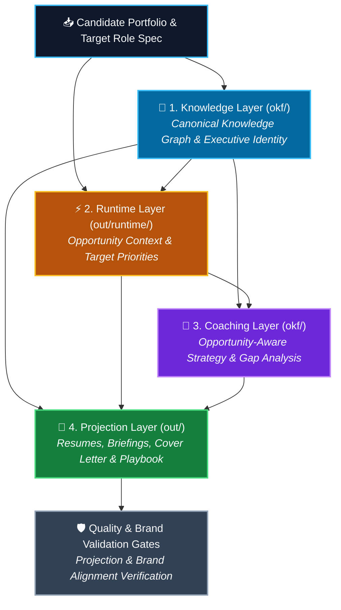
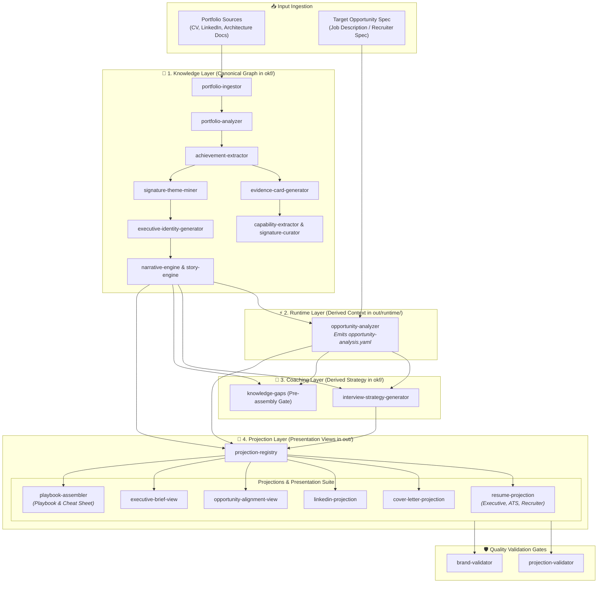
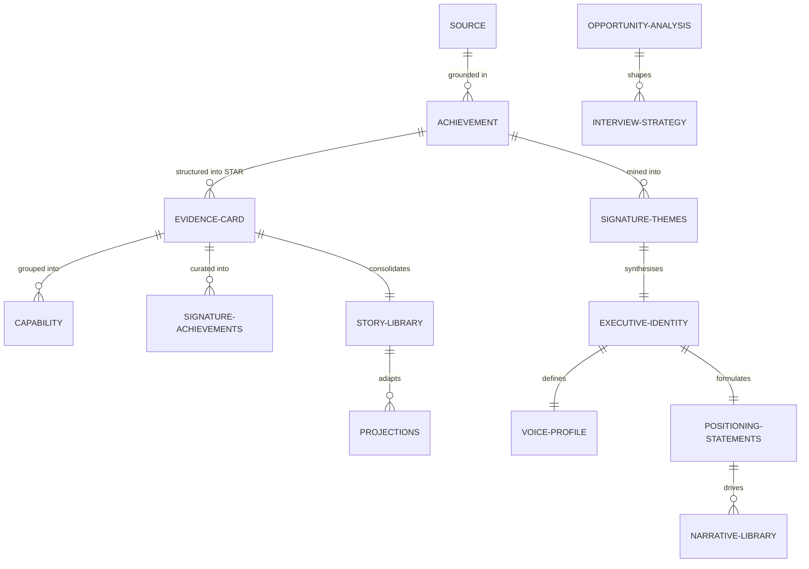

# Architecture

High-level architecture of the Career Projection Platform (Interview Playbook Generator v0.5). For approved design specs, see [`docs/superpowers/specs/`](docs/superpowers/specs/).

## What this system is

A pipeline that turns raw candidate portfolio material (CV, LinkedIn export, slide decks, architecture docs, publications, JD, recruiter message) into a **structured knowledge graph** of the candidate's career, and from that graph produces multiple tailored **executive communication projections** (Resumes, Cover Letters, LinkedIn Profiles, Briefings, Playbooks).

Four-Layer Pipeline Architecture:

- **Knowledge Layer** (canonical; stored in `out/okf/`): Stores persistent canonical career knowledge (`Achievement`, `EvidenceCard`, `Capability`, `SignatureAchievements`, `ExecutiveBehaviourProfile`, `ExecutiveIdentity`, `VoiceProfile`, `PositioningStatements`, `NarrativeLibrary`, `StoryLibrary`, `MessagingLibrary`, `Theme`, `Narrative`). Never modified by projections and shared across all target opportunities.
- **Runtime Layer** (execution context; stored in `out/<target-slug>/runtime/`): Stores derived opportunity analysis (`opportunity-analysis.yaml`), projection validation reports (`projection-validation-report.yaml`), and brand validation reports (`brand-validation-report.yaml`).
- **Coaching Layer** (derived strategy; stored in `okf/`): Computes opportunity-specific interview strategy (`InterviewStrategy`) and gap analysis (`KnowledgeGap`).
- **Projection Layer** (presentation views; stored in `out/<target-slug>/`): Generates read-only executive communication projections (`resume-executive.md`, `resume-ats.md`, `resume-recruiter.md`, `cover-letter.md`, `linkedin-profile.md`, `playbook.md`, `interview-cheatsheet.md`, `executive-brief.md`, `opportunity-alignment.md`).

The load-bearing principles:
1. Introductory prose and executive voice are established canonically in `okf/` and adapted by projections rather than independently generated.
2. Opportunity-specific execution context and views are scoped per target opportunity under `out/<target-slug>/` (derived from `target_opportunity.source`), preventing runs for different job opportunities from overwriting each other.

## Component responsibilities

| Layer | Component | Purpose |
|---|---|---|
| **Knowledge** | `portfolio-ingestor` | Discovers and classifies portfolio source files. |
| **Knowledge** | `portfolio-analyzer` | Builds top-level coverage map and domain breakdown. |
| **Knowledge** | `achievement-extractor` | Extracts evidence-grounded achievement nodes. |
| **Knowledge** | `evidence-card-generator` | Converts achievements into STAR Evidence Cards. |
| **Knowledge** | `behaviour-profile-generator` | Infers executive behaviour profile across core & optional dimensions. |
| **Knowledge** | `capability-extractor` | Groups evidence cards into structured capability nodes. |
| **Knowledge** | `signature-achievements-curator` | Curates signature achievements ranked on intrinsic properties. |
| **Knowledge** | `signature-theme-miner` | Mines recurring executive themes across portfolio. |
| **Knowledge** | `executive-identity-generator` | Synthesises canonical Executive Identity, Voice Profile, and Positioning Statements. |
| **Knowledge** | `narrative-engine` | Generates canonical Narrative Library and Messaging Library. |
| **Knowledge** | `story-engine` | Converts Evidence Cards into single consolidated `okf/story-library.md`. |
| **Runtime** | `opportunity-analyzer` | Generates shared execution context at `out/<target-slug>/runtime/opportunity-analysis.yaml`. |
| **Coaching** | `interview-strategy-generator` | Computes opportunity strategy and story-to-question mapping. |
| **Coaching** | `knowledge-gaps` | Pre-assembly evaluation gate assessing bundle against target role. |
| **Projection**| `projection-registry` | Orchestrates pluggable projection contracts into `out/<target-slug>/`. |
| **Projection**| `resume-projection` | Generates Executive, ATS, and Recruiter resume variants in `out/<target-slug>/`. |
| **Projection**| `cover-letter-projection` | Generates 1-page executive cover letter at `out/<target-slug>/cover-letter.md`. |
| **Projection**| `linkedin-projection` | Generates LinkedIn profile optimization at `out/<target-slug>/linkedin-profile.md`. |
| **Projection**| `opportunity-alignment-view` | Generates requirement alignment view at `out/<target-slug>/opportunity-alignment.md`. |
| **Projection**| `executive-brief-view` | Generates 10-minute briefing at `out/<target-slug>/executive-brief.md`. |
| **Projection**| `playbook-assembler` | Generates `out/<target-slug>/playbook.md` and `out/<target-slug>/interview-cheatsheet.md`. |
| **Runtime** | `projection-validator` | Evaluates evidence traceability & ATS coverage (`out/<target-slug>/runtime/projection-validation-report.yaml`). |
| **Runtime** | `brand-validator` | Evaluates cross-projection brand alignment & voice consistency (`out/<target-slug>/runtime/brand-validation-report.yaml`). |

## Architecture Diagram

<!-- BEGIN AUTO-GENERATED ARCHITECTURE DIAGRAM -->
### System Architecture Overview

### Detailed 4-Layer Skill Data Flow

### OKF Knowledge Graph Schema

<!-- END AUTO-GENERATED ARCHITECTURE DIAGRAM -->
