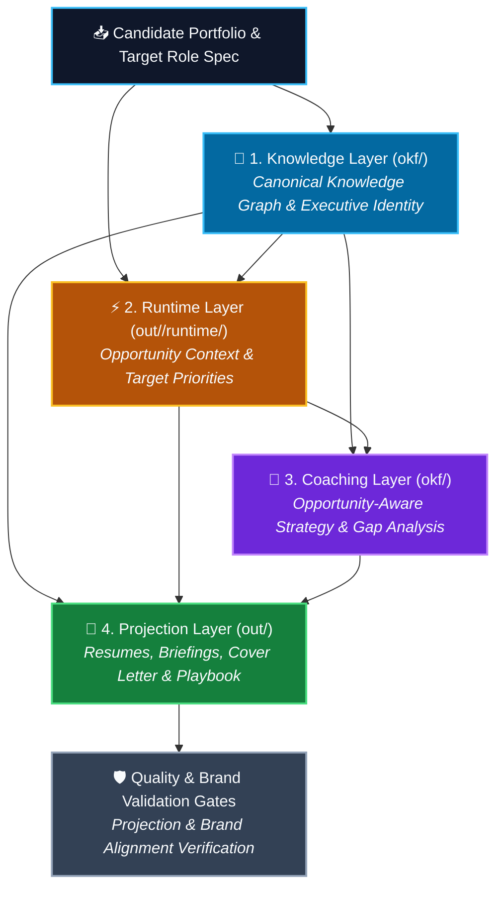
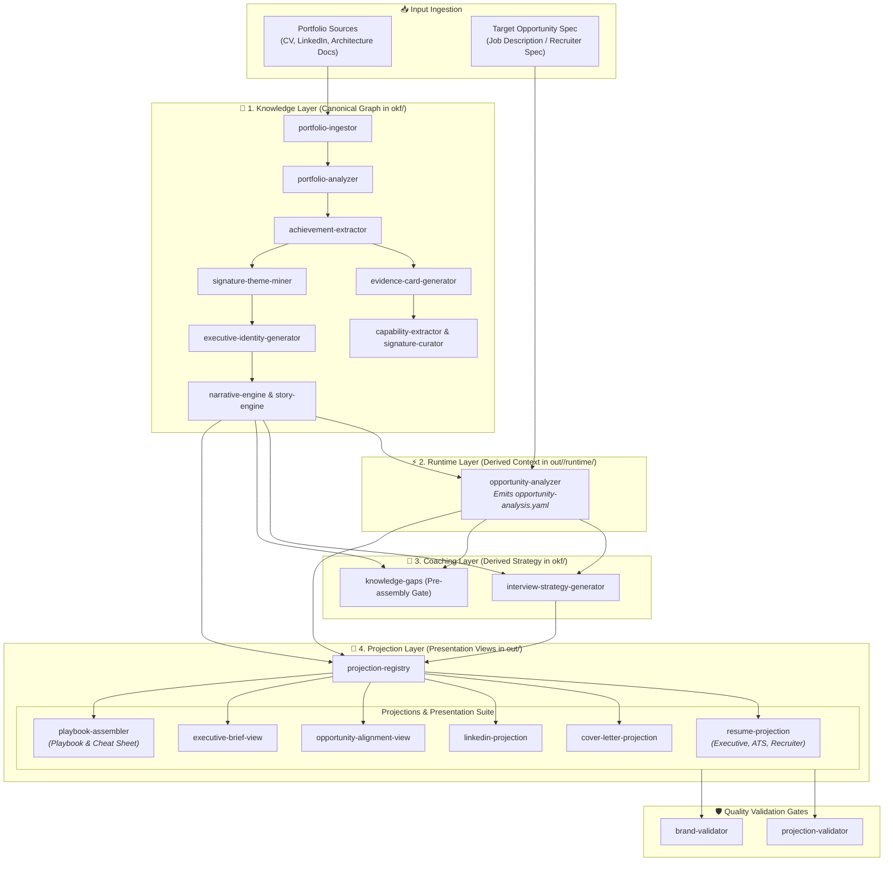
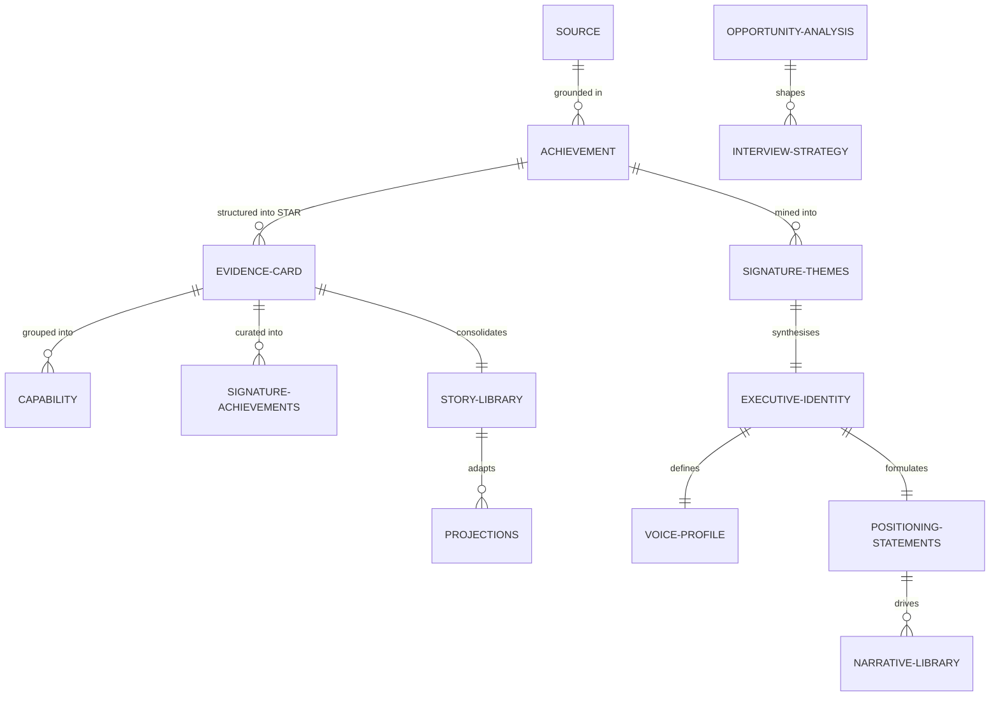

# Architecture

High-level architecture of the Career Projection Platform (Interview Playbook Generator v0.6). For approved design specs, see [`specs/`](specs/).

---

## 1. System Purpose

The Career Projection Platform turns raw candidate portfolio material (CV, LinkedIn export, corporate performance appraisals, slide decks, architecture docs, publications) and target opportunity specifications (JD / recruiter message / role spec) into:
1. An immutable, human-curated **Canonical Career Record** (`career-record.yaml`).
2. A structured **OKF v0.2 Knowledge Graph** of the candidate's career experience (`out/okf/`).
3. An opportunity-scoped **Runtime Intelligence Layer** (`out/<target-slug>/runtime/`), including frozen factual selections (`canonical-selection.yaml`).
4. Multiple tailored **Executive Communication Projections** (Resumes, Cover Letters, LinkedIn Profiles, Briefings, Upwork Proposals, Playbooks) in `out/<target-slug>/`.
5. Rigorous **Validation & Sanitization Reports** evaluating factual integrity, evidence boundaries, and brand consistency.

There is no LLM runtime codebase to execute; the AI agent itself acts as the runtime following skill definitions in `skills/<name>/SKILL.md`, supplemented by deterministic Python scripts in `scripts/`.

---

## 2. Major Components & Layer Responsibilities

| Layer | Component | Implementation | Purpose & Responsibilities |
|---|---|---|---|
| **Canonical** | `career-record.yaml` | YAML file | Supreme source of truth for all professional facts (employment, formal titles, dates, education, certifications). |
| **Canonical** | `canonical_loader.py` | Python script | Fast-fail (<1s) read-only parser and validator for `career-record.yaml`. |
| **Knowledge** | `portfolio-ingestor` | Skill + `scripts/ingest_portfolio.py` | Ingests portfolio files into `out/okf/sources/`, strictly excluding `quarantine/`. Populates `out/okf/employment-records.yaml`. |
| **Knowledge** | `portfolio-analyzer` | Skill | Builds top-level coverage map and domain breakdown in `out/okf/portfolio.md`. |
| **Knowledge** | `achievement-extractor` | Skill | Extracts evidence-grounded achievement nodes in `out/okf/achievements/`. |
| **Knowledge** | `evidence-card-generator` | Skill | Converts achievements into structured STAR Evidence Cards in `out/okf/evidence/`. |
| **Knowledge** | `behaviour-profile-generator` | Skill | Infers executive behaviour profile across core & optional dimensions (`out/okf/behaviour-profile.md`). |
| **Knowledge** | `capability-extractor` | Skill | Groups evidence cards into structured capability nodes in `out/okf/capabilities/`. |
| **Knowledge** | `signature-achievements-curator` | Skill | Curates signature achievements ranked on intrinsic properties (`out/okf/signature-achievements.md`). |
| **Knowledge** | `signature-theme-miner` | Skill | Mines recurring executive themes across portfolio (`out/okf/signature-themes.md`). |
| **Knowledge** | `executive-identity-generator` | Skill | Synthesises canonical Executive Identity, Voice Profile, and Positioning Statements in `out/okf/`. |
| **Knowledge** | `narrative-engine` | Skill | Formulates canonical Narrative Library and Messaging Library in `out/okf/`. |
| **Knowledge** | `story-engine` | Skill | Converts Evidence Cards into consolidated `out/okf/story-library.md`. |
| **Runtime** | `opportunity-analyzer` | Skill | Generates shared execution context at `out/<target-slug>/runtime/opportunity-analysis.yaml`. |
| **Runtime** | `canonical_selector.py` | Python script (Activity A) | Extracts and freezes immutable canonical facts into `out/<target-slug>/runtime/canonical-selection.yaml`. |
| **Runtime** | `upwork-qualification` | Skill | Assesses qualification state at `out/<target-slug>/runtime/upwork-qualification.yaml` (when target is Upwork). |
| **Runtime** | `archetype-classifier` | Skill | Classifies target position archetype in `out/<target-slug>/runtime/archetype-analysis.yaml`. |
| **Runtime** | `gap-classifier` | Skill | Evaluates missing capability gaps in `out/<target-slug>/runtime/gap-analysis.yaml`. |
| **Runtime** | `archetype-fit-evaluator` | Skill | Evaluates position fit in `out/<target-slug>/runtime/opportunity-fit-report.yaml`. |
| **Runtime** | `projection-strategy-generator` | Skill | Computes target projection strategy in `out/<target-slug>/runtime/projection-strategy.yaml`. |
| **Coaching** | `interview-strategy-generator` | Skill | Computes opportunity strategy and story-to-question mapping (`out/okf/interview-strategy.md`). |
| **Coaching** | `knowledge-gaps` | Skill | Pre-assembly evaluation gate assessing bundle against target role (`out/okf/knowledge-gaps.md`). |
| **Projection**| `projection-registry` | Skill | Orchestrates pluggable projection contracts into `out/<target-slug>/`. |
| **Projection**| `resume-projection` | Skill | Generates Executive, ATS, and Recruiter resume variants in `out/<target-slug>/`. |
| **Projection**| `cover-letter-projection` | Skill | Generates 1-page executive cover letter at `out/<target-slug>/cover-letter.md`. |
| **Projection**| `linkedin-projection` | Skill | Generates LinkedIn profile optimization at `out/<target-slug>/linkedin-profile.md`. |
| **Projection**| `opportunity-alignment-view` | Skill | Generates requirement alignment view at `out/<target-slug>/opportunity-alignment.md`. |
| **Projection**| `executive-brief-view` | Skill | Generates 10-minute briefing at `out/<target-slug>/executive-brief.md`. |
| **Projection**| `upwork-proposal` | Skill | Generates executive proposal, screening Q&A, work samples, and gap reports. |
| **Projection**| `playbook-assembler` | Skill | Generates `out/<target-slug>/playbook.md` and `out/<target-slug>/interview-cheatsheet.md`. |
| **Validation**| `canonical_validator.py` | Python script | Runs deterministic audit detecting factual discrepancies, emitting `canonical-conflict-report.yaml`. |
| **Validation**| `projection-validator` | Skill + `scripts/employment_validator.py` | Evaluates evidence coverage, ATS density, and performs deterministic sanitization on generated projections. |
| **Validation**| `brand-validator` | Skill | Evaluates cross-projection brand alignment & voice consistency (`brand-validation-report.yaml`). |
| **Validation**| `archetype-fit-validator` | Skill | Validates against overpositioning relative to opportunity fit. |
| **Evaluation**| `market-feedback-evaluator` | Skill | Generates market feedback evaluations in `evaluation/opportunities/<target-slug>-evaluation.yaml`. |

---

## 3. Repository Structure

```
interview-playbook-generator/
├── config/
│   ├── config.yaml                     # Active pipeline configuration
│   ├── config.example.yaml             # Template configuration
│   └── target-position/                # Opportunity specifications (JDs, recruiter notes)
├── skills/                             # Agent skill definitions (SKILL.md per skill)
├── scripts/                            # Authoritative deterministic runtime scripts
│   ├── canonical_models.py             # Data models for Canonical Career Record
│   ├── canonical_loader.py             # Read-only loader with <1s fast-fail
│   ├── canonical_selector.py           # Activity A factual selection engine
│   ├── canonical_validator.py          # Conflict audit report generator
│   ├── employment_validator.py         # Deterministic validator & in-place sanitizer
│   ├── ingest_portfolio.py             # Ingestion engine (quarantine-excluding)
│   ├── upwork_validator.py             # Upwork proposal contract validator
│   └── generate_architecture_diagrams.py # Architecture visualization generator
├── tests/                              # 172 automated tests across 34 modules
│   ├── test_canonical_loader.py
│   ├── test_canonical_selection_contract.py
│   ├── test_canonical_validator.py
│   ├── test_career_evidence_integrity.py
│   ├── test_claim_evidence_validation.py
│   ├── test_projection_validator.py
│   └── ...
├── out/                                # Gitignored output root
│   ├── okf/                            # Canonical Knowledge Graph (shared across targets)
│   │   ├── sources/                    # OKF Source concepts
│   │   ├── achievements/               # OKF Achievement concepts
│   │   ├── evidence/                   # OKF STAR EvidenceCard concepts
│   │   ├── capabilities/               # OKF Capability concepts
│   │   ├── employment-records.yaml     # Direct projection of canonical career entries
│   │   └── log.md                      # Pipeline execution audit trail
│   └── <target-slug>/                  # Opportunity-scoped execution directory
│       ├── runtime/                    # Opportunity execution context & validation reports
│       │   ├── canonical-selection.yaml        # Frozen Activity A facts
│       │   ├── opportunity-analysis.yaml       # Shared target context & coverage matrix
│       │   ├── archetype-analysis.yaml         # Role archetype classification
│       │   ├── gap-analysis.yaml               # Capability gap evaluation
│       │   ├── opportunity-fit-report.yaml     # Fit scoring & qualification
│       │   ├── projection-strategy.yaml        # Presentation strategy & narrative weights
│       │   ├── canonical-conflict-report.yaml  # Conflict audit report
│       │   ├── projection-validation-report.yaml # Traceability & sanitization report
│       │   └── brand-validation-report.yaml    # Voice & brand consistency report
│       ├── resume-executive.md         # 2-page executive resume projection
│       ├── resume-ats.md               # ATS reverse-chronological resume projection
│       ├── resume-recruiter.md         # 1-2 page rapid-scan recruiter resume
│       ├── cover-letter.md             # 1-page executive cover letter
│       ├── linkedin-profile.md         # Profile optimization
│       ├── opportunity-alignment.md    # Requirement alignment matrix
│       ├── executive-brief.md          # 10-minute interview briefing
│       ├── playbook.md                 # Strategic interview coaching playbook
│       └── interview-cheatsheet.md     # 2-page quick reference cheatsheet
└── evaluation/
    └── opportunities/                  # Market feedback evaluation records
```

---

## 4. Canonical Data Architecture

### 4.1 Canonical Source of Truth
The supreme source of truth for all professional facts is `canonical/career-record.yaml`, hosted in the candidate's portfolio directory (`candidate.portfolio_dir`, currently `/Users/avfranco/GitHub/mind-palace/canonical/career-record.yaml`).

This human-curated file unconditionally supersedes:
- Secondary CVs, markdown resumes, or web biographies.
- Raw or historical LinkedIn CSV exports (`Positions.csv`, `Education.csv`).
- AI-synthesized profiles, previous proposal drafts, and runtime inferences.

### 4.2 Schema and Models
Parsed into Python dataclasses in [`scripts/canonical_models.py`](scripts/canonical_models.py):
- `CareerEntry`: Immutable employer name, formal title, start/end dates, current status, location, engagement type (`direct_employment`, `consultancy`, `independent_advisory`), client, approved aliases, operational scope, and evidence references.
- `EducationEntry`: Canonical institution, degree name, degree level, field of study, end year, status, and evidence references.
- `CertificationEntry`: Name, issuing body, year, status, and evidence references.
- `UnresolvedQuestion`: Tracked questions regarding career history (`resolved` vs `unresolved`). Unresolved items are surfaced exclusively in coaching collateral flagged `[NEEDS CONFIRMATION]`; they are excluded from external projections.

### 4.3 Loading Mechanism
[`scripts/canonical_loader.py`](scripts/canonical_loader.py) discovers and loads the record:
- Read-only access: Guarantees no skill or script can write to or mutate the canonical record.
- Fast-fail (<1s): Instantly raises `CanonicalRecordError` if the record is missing or malformed, preventing ungrounded fallback on legacy data.

### 4.4 Activity A: Factual Selection Decoupling
Factual selection is strictly decoupled from narrative projection:
1. During runtime analysis, [`scripts/canonical_selector.py`](scripts/canonical_selector.py) extracts opportunity-relevant roles, education, and certifications.
2. It freezes them into `out/<target-slug>/runtime/canonical-selection.yaml` conforming to the JSON schema in `specs/005-canonical-record-integration/contracts/canonical-selection-contract.yaml`.
3. Downstream projection skills consume these immutable selected facts and are prohibited from altering dates, titles, or credentials.

---

## 5. Knowledge Architecture

The Knowledge Layer resides in `out/okf/` and constitutes the persistent canonical career knowledge graph. It is generated once across opportunities and is never modified by downstream projections.

### Concept Types (OKF v0.2 Compliant)
- `Source` & `SourceIndex`: Ingested primary evidence files and master source catalog.
- `Achievement`: Evidence-grounded candidate accomplishment statements.
- `EvidenceCard`: Reusable STAR-structured capability cards with strict footnote attribution.
- `Capability`: Synthesized groupings of evidence cards across architectural disciplines.
- `SignatureAchievements`: Curated top accomplishments ranked by intrinsic scale and impact.
- `ExecutiveBehaviourProfile`: 4 core behavioral dimensions (Strategic Horizon, System Complexity, Organizational Scale, Executive Engagement) + 3 optional dimensions.
- `ExecutiveIdentity`, `VoiceProfile`, `PositioningStatements`: Master executive brand positioning and tone guidelines.
- `NarrativeLibrary`, `StoryLibrary`, `MessagingLibrary`: Consolidated reusable narratives and STAR stories.

---

## 6. Opportunity Runtime Architecture

Derived execution context is strictly scoped to `out/<target-slug>/runtime/`. This guarantees that runs for different opportunities never collide or overwrite each other.

### Artefact Roles & Authoritative Status

| Artefact | Producer | Inputs | Consumers | Nature | Overrides Canonical? |
|---|---|---|---|---|---|
| `canonical-selection.yaml` | `scripts/canonical_selector.py` | `canonical/career-record.yaml` | Projection skills | **Authoritative** (frozen factual subset) | No (Derived directly from it) |
| `opportunity-analysis.yaml` | `opportunity-analyzer` | `config.yaml`, Target JD, `okf/capabilities/` | Classifiers, Evaluators, Projections | **Analytical / Strategic** (target requirements & coverage) | No |
| `archetype-analysis.yaml` | `archetype-classifier` | `opportunity-analysis.yaml` | `archetype-fit-evaluator`, `projection-strategy` | **Analytical** (role classification) | No |
| `gap-analysis.yaml` | `gap-classifier` | `opportunity-analysis.yaml`, `okf/capabilities/` | Evaluator, Strategy, Coaching | **Analytical** (capability gap sizing) | No |
| `opportunity-fit-report.yaml`| `archetype-fit-evaluator` | Archetype, Gap, & Opportunity YAMLs | `projection-strategy`, `knowledge-gaps` | **Analytical** (fit score & qualification) | No |
| `projection-strategy.yaml` | `projection-strategy-generator`| Opportunity Fit & Gap YAMLs | Projection skills | **Strategic** (framing & narrative weight) | No |
| `canonical-conflict-report.yaml` | `scripts/canonical_validator.py` | Generated projections, `career-record.yaml` | Validation gate, pipeline audit | **Governance** (conflict audit) | Enforces canonical |
| `projection-validation-report.yaml`| `scripts/employment_validator.py`| Generated projections, canonical records | Validation gate, pipeline audit | **Governance** (coverage & sanitization) | Enforces canonical |
| `brand-validation-report.yaml` | `brand-validator` | Generated projections, `ExecutiveIdentity` | Validation gate, pipeline audit | **Governance** (tone & positioning) | No |

---

## 7. Projection Architecture

Projections represent tailored, presentation-ready communication artefacts in `out/<target-slug>/`.

### Generation Process
1. **Orchestration**: Managed by `projection-registry`, which discovers active projections and executes corresponding skills.
2. **Inputs Consumed**:
   - `out/<target-slug>/runtime/canonical-selection.yaml` (immutable facts: roles, titles, dates, education, certifications).
   - `out/<target-slug>/runtime/opportunity-analysis.yaml` (target requirements, ATS keywords, coverage matrix).
   - `out/<target-slug>/runtime/projection-strategy.yaml` (narrative emphasis, positioning guidance).
   - `out/okf/` (identity, narratives, messaging, STAR stories).
3. **Execution Mode**: Skills format and adapt prose while strictly adhering to frozen canonical facts.

### Standard Output Projections
- `resume-executive.md`: 2-page strategic document with 10 standard sections highlighting leadership outcomes and architecture progression.
- `resume-ats.md`: Reverse-chronological resume incorporating mandatory and strong ATS terminology.
- `resume-recruiter.md`: Concise 1-2 page resume designed for rapid 30-60 second recruiter scanning.
- `cover-letter.md`: 1-page executive cover letter grounded in candidate identity.
- `linkedin-profile.md`: Headline, about summary, and experience optimization.
- `opportunity-alignment.md`: Requirement-by-requirement evidence mapping.
- `executive-brief.md`: 10-minute pre-interview executive cheat sheet.
- `playbook.md` & `interview-cheatsheet.md`: In-depth interview coaching, story-to-question mappings, and objection handling.

---

## 8. Validation Architecture & Automated Sanitization

The platform employs a deterministic dual-validation and sanitization mechanism:

### 8.1 Canonical Conflict Audit (`scripts/canonical_validator.py`)
Scans generated projection text against hardcoded canonical facts, detecting:
- **Degree / Institution Inflation**: MSc claims or unverified institutions (e.g. UFRJ / Federal University of Rio de Janeiro) overridden to BSc Computer Science, Universidade de Mogi das Cruzes.
- **Formal Title Inflation**: Inflated titles (e.g. BBC Head of Enterprise Architecture) overridden to canonical formal title (`Lead Enterprise Architect - Technology Transformation Group`).
- **Chronology Mutations**: Fabricated start dates or split tenures (e.g. WPP 2022-Present, BBC 2020-2022, BAT R&D 2016-2020) overridden to canonical dates.
- **Employer Relationship Conflation**: Merged employment periods or direct employer confusion (e.g. Compugraf and Souza Cruz treated as simultaneous direct employers) overridden to consultancy relationship.
- **Claim Strength Inflation**: Unsupported enhancements (e.g. "established and led EA governance" when evidence only supports "supported and contributed to") overridden.

### 8.2 Employment Validator & Automated Sanitization (`scripts/employment_validator.py`)
Deterministic validator integrated into `projection-validator`:
- Validates section headers in markdown against `canonical_records`.
- **In-Place Sanitization**: If a projection contains mutated dates or inflated titles, `sanitize_artefact_content()` rewrites the offending string back to canonical truth in place and records the action in `projection-validation-report.yaml`.

---

## 9. Information-Flow Boundaries

The platform enforces strict physical tier boundaries:

```
[ Tier 1: Canonical Source ] (mind-palace/canonical/career-record.yaml)
         │
         ├─── (scripts/canonical_loader.py)
         │         │
         │         ├─── (scripts/ingest_portfolio.py) ──────────────► [ Tier 2: Knowledge Layer ] (out/okf/)
         │         │                                                           │
         │         └─── (scripts/canonical_selector.py - Activity A)            │
         │                     │                                               │
         ▼                     ▼                                               │
[ Tier 3: Opportunity Runtime ] (out/<target-slug>/runtime/)                   │
         │                     ▲                                               │
         │                     └─────────── (Activity B: Narrative Strategy) ──┤
         ▼                                                                     │
[ Tier 4: Projections ] (out/<target-slug>/) ◄─────────────────────────────────┘
         │
         ▼
[ Tier 5: Validation & Sanitization ] (canonical_validator & projection-validator)
```

### Boundary Invariants
1. **`projection → canonical` is STRICTLY FORBIDDEN**: Output projections and runtime artefacts can never be written to or ingested by `canonical/` or `out/okf/`.
2. **`quarantine → any` is STRUCTURALLY EXCLUDED**: The `quarantine/` directory in `candidate.portfolio_dir` is hardcoded to be skipped during ingestion.
3. **`projections(target A) → projections(target B)` is STRICTLY FORBIDDEN**: Cross-opportunity contamination is prohibited. Projections must never read prior target output folders.

---

## 10. Testing Architecture

The platform includes 172 automated tests across 34 modules in `tests/`:

- **Canonical Loader Tests** (`test_canonical_loader.py`): Verifies YAML discovery, schema parsing into dataclasses, and fast-fail (<1s) behavior on missing files.
- **Canonical Selection Contract Tests** (`test_canonical_selection_contract.py`): Validates `canonical-selection.yaml` schema conformance and Activity A freezing.
- **Canonical Conflict Audit Tests** (`test_canonical_validator.py`): Tests regex detection of degree inflation, title inflation, date mutation, and claim strength escalation.
- **Career Evidence Integrity Tests** (`test_career_evidence_integrity.py`, `test_canonical_record_regression.py`): Tests immutability of career chronologies and regression against known historical defects.
- **Claim-Evidence & Boundary Tests** (`test_claim_evidence_validation.py`, `test_boundary_transferability.py`): Validates footnote attribution, transferable framing, and contribution vs leadership boundaries.
- **Skill Snapshot & Regression Tests** (`test_skills.py`, `test_v03` to `test_v06_success_criteria.py`): Ensures skill outputs comply with contracts across versions.
- **Validator & Sanitizer Tests** (`test_projection_validator.py`, `test_brand_validator.py`): Tests automated rewriting of discrepancies and brand voice checks.
- **Architecture Diagram Tests** (`test_architecture_diagram_generator.py`): Verifies automated generation and diagram marker integrity.

---

## 11. Current Limitations & Known Forensic Findings

Recent forensic investigations (Tenth AI Lead EA and LSEG Director EA generations) identified specific current-state limitations:

- **Finding A — Partial Canonical-Selection Context**: Projections historically risked loading only career role records from `canonical-selection.yaml`, leaving education and certification blocks outside active model context, leading to ungrounded degree generation.
- **Finding B — Cross-Opportunity Contamination**: Historical risk where previously generated opportunity folders (e.g. `out/lseg-director-enterprise-architecture/`) were read as structural references during another run, leaking target-specific wording.
- **Finding C — Target JD Keyword Leakage**: Target JD keywords (e.g. Workday, NetSuite, Coupa, Concur, or CCoE frameworks) entered ATS vocabulary and were subsequently treated as candidate-evidenced capabilities without canonical proof.
- **Finding D — Deterministic Validation Gaps**: Current validators (`canonical_validator.py` and `employment_validator.py`) are regex/pattern-based, targeting known defect patterns. They do NOT currently validate:
  - Exact education start and end dates.
  - Secondary certifications beyond SAFe/TOGAF/LeanIX.
  - Foreign language proficiencies.
  - Arbitrary named technologies outside hardcoded patterns.
  - Cross-opportunity directory leakage.

---

## 12. Current vs Proposed / Future Architecture

| Dimension | Current Implementation (v0.6) | Proposed / Future Remediation |
|---|---|---|
| **Canonical Source** | Read-only YAML loaded via `scripts/canonical_loader.py`. | Dedicated canonical SQLite / graph database with cryptographic checksums. |
| **Factual Selection** | Activity A engine in `scripts/canonical_selector.py` freezing YAML. | Schema-enforced static type checking and automated candidate fact locking. |
| **Validation Mechanism** | Deterministic regex matching & in-place text sanitization. | Complete AST-based markdown parsing, semantic claim-level verification, and LLM-as-judge evidence bounds. |
| **Technology Claim Bounds**| Hard rule enforcement and manual review. | Dynamic technology dictionary checking every tool claim against `career-record.yaml`. |
| **Cross-Opportunity Isolation** | Operational protocol and directory separation (`out/<target-slug>/`). | Hermetic runtime sandboxing preventing agents from accessing non-target output subtrees. |
| **Education & Certs Context** | Explicit operational rule requiring full selection YAML loading. | Automated pre-generation context injection validator. |

---

## Architecture Diagram

<!-- BEGIN AUTO-GENERATED ARCHITECTURE DIAGRAM -->
### System Architecture Overview


```mermaid
flowchart TD
    classDef inputStyle fill:#0F172A,stroke:#38BDF8,stroke-width:2px,color:#F8FAFC
    classDef knowledgeStyle fill:#0369A1,stroke:#38BDF8,stroke-width:2px,color:#F8FAFC
    classDef runtimeStyle fill:#B45309,stroke:#FBBF24,stroke-width:2px,color:#F8FAFC
    classDef coachingStyle fill:#6D28D9,stroke:#C084FC,stroke-width:2px,color:#F8FAFC
    classDef projectionStyle fill:#15803D,stroke:#4ADE80,stroke-width:2px,color:#F8FAFC
    classDef validateStyle fill:#334155,stroke:#94A3B8,stroke-width:2px,color:#F8FAFC

    IN["📥 Candidate Portfolio & Target Role Spec"]:::inputStyle
    KL["🧠 1. Knowledge Layer (okf/)<br/><i>Canonical Knowledge Graph & Executive Identity</i>"]:::knowledgeStyle
    RL["⚡ 2. Runtime Layer (out/<target-slug>/runtime/)<br/><i>Opportunity Context & Target Priorities</i>"]:::runtimeStyle
    CL["🎯 3. Coaching Layer (okf/)<br/><i>Opportunity-Aware Strategy & Gap Analysis</i>"]:::coachingStyle
    PL["📄 4. Projection Layer (out/)<br/><i>Resumes, Briefings, Cover Letter & Playbook</i>"]:::projectionStyle
    VG["🛡️ Quality & Brand Validation Gates<br/><i>Projection & Brand Alignment Verification</i>"]:::validateStyle

    IN --> KL
    IN --> RL
    KL --> RL
    KL --> CL
    RL --> CL
    KL --> PL
    RL --> PL
    CL --> PL
    PL --> VG
```

### Detailed 4-Layer Skill Data Flow


```mermaid
flowchart TD
    subgraph S0["📥 Input Ingestion"]
        direction LR
        IN_CV["Portfolio Sources<br/>(CV, LinkedIn, Architecture Docs)"]
        IN_JD["Target Opportunity Spec<br/>(Job Description / Recruiter Spec)"]
    end

    subgraph S1["🧠 1. Knowledge Layer (Canonical Graph in okf/)"]
        direction TB
        S1_ING["portfolio-ingestor"] --> S1_ANA["portfolio-analyzer"]
        S1_ANA --> S1_ACH["achievement-extractor"]
        S1_ACH --> S1_EVD["evidence-card-generator"]
        S1_EVD --> S1_CAP["capability-extractor & signature-curator"]
        S1_ACH --> S1_THM["signature-theme-miner"]
        S1_THM --> S1_IDN["executive-identity-generator"]
        S1_IDN --> S1_NAR["narrative-engine & story-engine"]
    end

    subgraph S2["⚡ 2. Runtime Layer (Derived Context in out/<target-slug>/runtime/)"]
        S2_OPP["opportunity-analyzer<br/><i>Emits opportunity-analysis.yaml</i>"]
    end

    subgraph S3["🎯 3. Coaching Layer (Derived Strategy in okf/)"]
        S3_STR["interview-strategy-generator"]
        S3_GAP["knowledge-gaps (Pre-assembly Gate)"]
    end

    subgraph S4["📄 4. Projection Layer (Presentation Views in out/)"]
        direction TB
        S4_REG["projection-registry"]
        subgraph S4_VIEWS["Projections & Presentation Suite"]
            direction LR
            V_RES["resume-projection<br/><i>(Executive, ATS, Recruiter)</i>"]
            V_COV["cover-letter-projection"]
            V_LKD["linkedin-projection"]
            V_ALI["opportunity-alignment-view"]
            V_BRF["executive-brief-view"]
            V_PBK["playbook-assembler<br/><i>(Playbook & Cheat Sheet)</i>"]
        end
        S4_REG --> V_RES
        S4_REG --> V_COV
        S4_REG --> V_LKD
        S4_REG --> V_ALI
        S4_REG --> V_BRF
        S4_REG --> V_PBK
    end

    subgraph S5["🛡️ Quality Validation Gates"]
        S5_PV["projection-validator"]
        S5_BV["brand-validator"]
    end

    IN_CV --> S1_ING
    IN_JD --> S2_OPP
    S1_NAR --> S2_OPP
    S1_NAR --> S3_STR
    S2_OPP --> S3_STR
    S1_NAR --> S3_GAP
    S2_OPP --> S3_GAP
    S1_NAR --> S4_REG
    S2_OPP --> S4_REG
    S3_STR --> S4_REG
    S4_VIEWS --> S5_PV
    S4_VIEWS --> S5_BV
```

### OKF Knowledge Graph Schema


```mermaid
erDiagram
    SOURCE ||--o{ ACHIEVEMENT : "grounded in"
    ACHIEVEMENT ||--o{ EVIDENCE-CARD : "structured into STAR"
    EVIDENCE-CARD ||--o{ CAPABILITY : "grouped into"
    EVIDENCE-CARD ||--o{ SIGNATURE-ACHIEVEMENTS : "curated into"
    ACHIEVEMENT ||--o{ SIGNATURE-THEMES : "mined into"
    SIGNATURE-THEMES ||--|| EXECUTIVE-IDENTITY : "synthesises"
    EXECUTIVE-IDENTITY ||--|| VOICE-PROFILE : "defines"
    EXECUTIVE-IDENTITY ||--|| POSITIONING-STATEMENTS : "formulates"
    POSITIONING-STATEMENTS ||--o{ NARRATIVE-LIBRARY : "drives"
    EVIDENCE-CARD ||--|| STORY-LIBRARY : "consolidates"
    OPPORTUNITY-ANALYSIS ||--o{ INTERVIEW-STRATEGY : "shapes"
    STORY-LIBRARY ||--o{ PROJECTIONS : "adapts"
```
<!-- END AUTO-GENERATED ARCHITECTURE DIAGRAM -->

