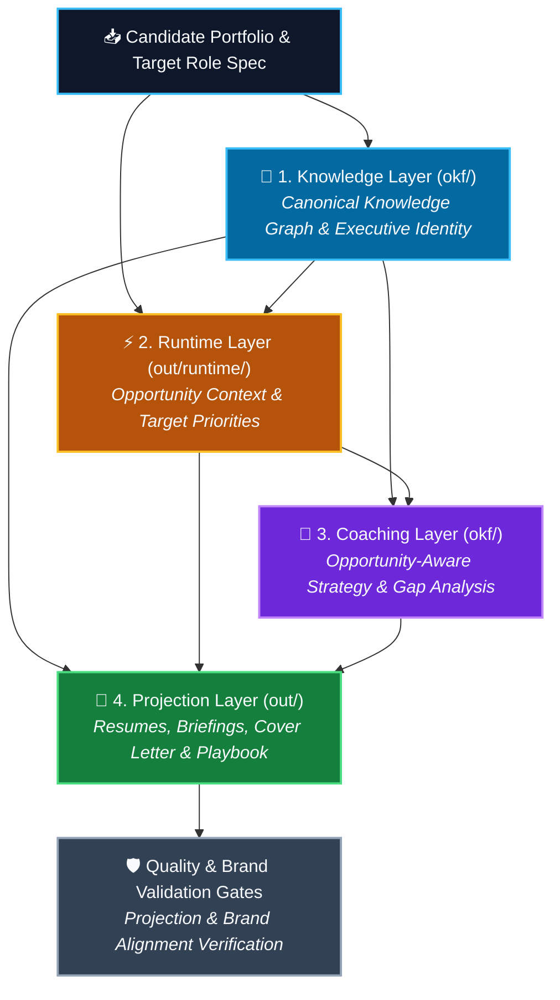

# Career Projection Platform (Interview Playbook Generator)

Generate high-quality executive communication artefacts (Resumes, Cover Letters, LinkedIn Profiles, Briefings, and Interview Playbooks) from a candidate's portfolio and career knowledge — grounded in evidence, adapted to the target opportunity, and structured as a reusable knowledge graph.

<!-- BEGIN AUTO-GENERATED ARCHITECTURE DIAGRAM -->
### System Architecture Overview

<!-- END AUTO-GENERATED ARCHITECTURE DIAGRAM -->

## Status

**v0.5 (Sprint 5) Executive Narrative & Personal Brand Engine Active with Opportunity-Scoped Output Subtrees (`out/<target-slug>/`).** All 25 Skills, canonical Executive Identity Layer (`okf/executive-identity.md`, `okf/voice-profile.md`, `okf/positioning-statements.md`, `okf/narrative-library.md`, `okf/story-library.md`, `okf/messaging-library.md`), Projection SDK & Registry, Brand Validator, and target opportunity slug scoping (`out/<target-slug>/`) are tested and active.

## How it works (one paragraph)

A local-first pipeline of **Claude Skills** in this repo reads a YAML config plus raw portfolio sources (CV, LinkedIn, slide decks, architecture docs, etc.), runs Skills that progressively structure the candidate's career into an **OKF (Open Knowledge Format) v0.2** knowledge graph on disk (`okf/`), establishes a canonical Executive Identity Layer, runs an opportunity analyzer producing shared execution context (`out/<target-slug>/runtime/opportunity-analysis.yaml`), and orchestrates registered projection Skills (`resume-projection`, `cover-letter-projection`, `linkedin-projection`, `executive-brief-view`, `opportunity-alignment-view`, `playbook-assembler`) to produce read-only presentation views in `out/<target-slug>/`.

## Architecture at a glance

- **Four explicit layers (v0.5):**
  - *Knowledge Layer* (canonical, in `out/okf/`): persistent, immutable career concepts (`Achievement`, `EvidenceCard`, `Capability`, `SignatureAchievements`, `ExecutiveBehaviourProfile`, `ExecutiveIdentity`, `VoiceProfile`, `PositioningStatements`, `NarrativeLibrary`, `StoryLibrary`, `MessagingLibrary`, `Theme`, `Narrative`). Shared across all target opportunities.
  - *Runtime Layer* (derived execution context, in `out/<target-slug>/runtime/`): shared opportunity analysis (`opportunity-analysis.yaml`), projection validation report (`projection-validation-report.yaml`), and brand validation report (`brand-validation-report.yaml`).
  - *Coaching Layer* (derived strategy, in `okf/`): opportunity-aware strategy & knowledge gaps.
  - *Projection Layer* (presentation views, in `out/<target-slug>/`): read-only executive communication projections (`resume-executive.md`, `resume-ats.md`, `resume-recruiter.md`, `cover-letter.md`, `linkedin-profile.md`, `playbook.md`, `interview-cheatsheet.md`, `executive-brief.md`, `opportunity-alignment.md`).
- **Opportunity-Scoped Output Subtrees (`out/<target-slug>/`):** Opportunity-specific outputs (runtime context, validation reports, presentation projections) are saved under `out/<target-slug>/` (auto-derived from `target_opportunity.source` in `config/config.yaml`), persisting historic runs across different job opportunities without overwriting.
- **Pluggable Projection SDK & Registry:** Projections implement a standardized contract and register with `projection-registry`.
- **Quality discipline:** Every claim in the bundle is tagged `[evidence | inference | recommendation | assumption]`; every concept carries source attribution. The system never fabricates metrics, budgets, or responsibilities.
