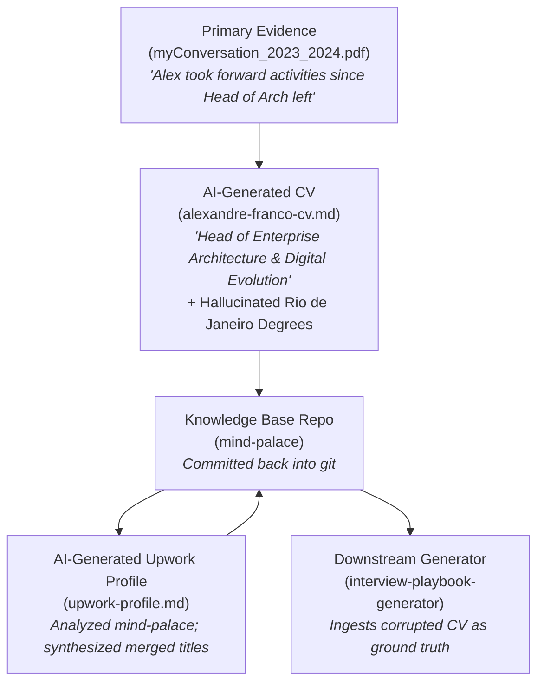

# Personal Knowledge Base — Forensic Data Quality Diagnostic

**Target Knowledge Base:** `/Users/avfranco/GitHub/mind-palace`  
**Execution Date:** 18 September 2026  
**Auditor:** Antigravity Forensic Diagnostic Engine  
**Target Output Document:** `/Users/avfranco/GitHub/interview-playbook-generator/docs/mind-palace-data-quality-forensic-diagnostic-report.md`  

---

## 1. Executive Summary

### 1.1 Overall Condition
The `mind-palace` knowledge base is an active, hybrid repository containing authentic primary corporate and career evidence alongside derived, regenerated, and AI-synthesized artefacts. While the core experiential evidence (particularly performance appraisals, LinkedIn exports, and published articles) is rich, authoritative, and credible, the repository as a whole exhibits **acute structural entropy, multiple critical factual contradictions, unverified AI hallucinations in key resume documents, and significant contamination loops**.

### 1.2 Most Important Findings
1. **Critical Education Hallucination in Derived CV:** The primary markdown CV ([`alexandre-franco-cv.md`](file:///Users/avfranco/GitHub/mind-palace/resume-profile/alexandre-franco-cv.md)) asserts that Alexandre holds an *MSc in Computer Science* and a *BSc in Computer Science* from the *Federal University of Rio de Janeiro*. Primary LinkedIn records ([`LinkedIn Profile.pdf`](file:///Users/avfranco/GitHub/mind-palace/resume-profile/LinkedIn%20Profile.pdf) and [`Education.csv`](file:///Users/avfranco/GitHub/mind-palace/resume-profile/Education.csv)) refute this: his degree is a *Bacharelado em Ciências da Computação (BSc)* from *Universidade de Mogi das Cruzes* (1988–1991), followed by postgraduate qualifications from *FGV* (2000–2001) and *SENAC* (2002–2003). Furthermore, [`about/about.md`](file:///Users/avfranco/GitHub/mind-palace/about/about.md) misclassifies the 1988–1991 Mogi das Cruzes degree as an "MSc".
2. **Title Divergence & Provenance Traceability:** [`alexandre-franco-cv.md`](file:///Users/avfranco/GitHub/mind-palace/resume-profile/alexandre-franco-cv.md) claims the role *"Head of Enterprise Architecture & Digital Evolution"* at BBC Studios (2021–2025). The primary HR records ([`Positions.csv`](file:///Users/avfranco/GitHub/mind-palace/resume-profile/Positions.csv) and performance management reviews) establish his official contracted titles as *"Lead Enterprise Architect - Commercial System"* (2021–2023) and *"Lead Enterprise Architect - Technology Transformation Group"* (2023–2025). Forensic analysis of [`myConversation_2023_2024.pdf`](file:///Users/avfranco/GitHub/mind-palace/resume-profile/PerformanceManagement/myConversation_2023_2024.pdf) uncovers the exact origin of this divergence: the VP of Technology Transformation noted that Alex *"taken forwards all the activities since the Head of Architecture left and not replaced"*. While operationally true in responsibility, presenting it as an official contracted title without contextual qualification creates background-check failure risks.
3. **Career Timeline Contraction & Omission (BAT 1997–2011):** Primary evidence ([`memorable-journey-24-years-ended-1st-october-alexandre-franco.html`](file:///Users/avfranco/GitHub/mind-palace/articles/memorable-journey-24-years-ended-1st-october-alexandre-franco.html) and [`Positions.csv`](file:///Users/avfranco/GitHub/mind-palace/resume-profile/Positions.csv)) verifies a continuous 24-year tenure at Souza Cruz / British American Tobacco from April 1997 to 1 October 2021. However, [`alexandre-franco-cv.md`](file:///Users/avfranco/GitHub/mind-palace/resume-profile/alexandre-franco-cv.md) truncates BAT to 2014–2021 (7 years), reassigns 2011–2014 to a generic London role, and completely obliterates the 1997–2011 Brazilian engineering foundation.
4. **Knowledge Contamination Loops:** AI-generated proposal files (e.g. [`upwork-profile.md`](file:///Users/avfranco/GitHub/mind-palace/portfolio/enterprise-architecture-practice-metholology/upwork/upwork-profile.md)) explicitly document analyzing `mind-palace` and merging disparate roles (e.g. merging SR&D EA and Global Integration SA into a single synthetic title). These derived files have been committed back into the knowledge base, risking recursive ingestion.
5. **Codebase Overweight & Stale Configuration:** 891 files (82% of the repository's total file count) consist of raw cloned Git repositories from WPP projects (`portfolio/wpp-work/ai-projects/`), containing extraneous node_modules, lockfiles, and tests that clutter search indexes. Simultaneously, repository guidance ([`CLAUDE.md`](file:///Users/avfranco/GitHub/mind-palace/CLAUDE.md)) is structurally stale, citing root paths (`standard-operational-procedure/`, `target-position/`, `portfolio/wpp-work/AI-Architecture-Enablement/`) that do not exist.

### 1.3 Major Risks
- **Background Check Disqualification:** Discrepancies in degree-granting institutions and job titles between candidate CVs and official verification records (e.g. Hireright/Sterling checks against BBC Studios HR and university registries).
- **Generator Hallucination Amplification:** If the `interview-playbook-generator` ingests `alexandre-franco-cv.md` as its primary knowledge source, downstream cover letters, executive resumes, and interview cheat sheets will reproduce fabricated academic credentials and truncated employment chronologies.
- **Narrative Contradiction in Executive Interviews:** Interview answers generated from performance review evidence (grounded in Lead Architect reality) will conflict with CV claims if the candidate is challenged on organizational hierarchy.

### 1.4 Assessment of Impact on `interview-playbook-generator`
The `interview-playbook-generator` pipeline is **critically exposed** to these defects. Because the generator's `portfolio-ingestor` processes files in `resume-profile/` and `portfolio/`, any pipeline execution that prioritizes `alexandre-franco-cv.md` over `Positions.csv` or `myConversation_*.pdf` will inject corrupted facts into the canonical `okf/` knowledge layer, propagating errors into all four output projections (Executive Resume, ATS Resume, Cover Letter, Playbook).

### 1.5 Root-Cause Attribution
The problem is a combination of:
- **30% Source Data Defect:** Legacy inconsistencies in LinkedIn CSV exports (such as TOGAF 9 listed under Education instead of Certifications).
- **50% AI Generation / Regeneration Drift:** Unvetted AI tools generated `alexandre-franco-cv.md` and `about/about.md`, hallucinating prestigious universities and inflating degrees, which were subsequently checked into git without rigorous forensic verification.
- **20% Knowledge Architecture Disorder:** Lack of clear separation between primary evidence (immutable), derived projections (read-only outputs), and raw work samples (cloned codebases).

---

## 2. Scope & Methodology

### 2.1 Sources Examined
A comprehensive census of all 1,081 non-hidden files in `/Users/avfranco/GitHub/mind-palace` was conducted, covering:
- **Primary Career Records & Exports:** `resume-profile/*.csv` (Positions, Education, Certifications, Skills, Recommendations, Endorsements, Learning, Profile, LinkedIn Profile).
- **Official Performance Reviews & Scanned Evidence:** `resume-profile/PerformanceManagement/*.pdf` (BBC Studios annual reviews 2021/2022, 2022/2023, 2023/2024, 2024/2025) and `resume-profile/LinkedIn Profile.pdf`.
- **Derived CVs & Profiles:** `resume-profile/alexandre-franco-cv.md`, `resume-profile/Alexandre Franco Resume - STAR.md`.
- **Published Articles:** 8 standalone HTML exports in `articles/`.
- **Reflective Journaling & Threads:** 13 weekly entries (`learnings/YYYYMMDD.md`) and 13 thematic synthesis essays (`learnings/threads/*.md`).
- **Narratives & Case Studies:** 6 HTML case studies in `narratives/` (`bat-transformation`, `bbc-studios-digital-evolution`, `cas`, `cas-coding-agent-collaboration`, `ea4all`, `runner-agentic-intelligence`).
- **Web & Positioning Content:** `about/*.md` (`about.md`, `architecture-philosophy.md`, `contact.md`, `how-i-work.md`), `portfolio/index.html`, `portfolio/Projects.csv`.
- **Architecture Methodology & Upwork Collateral:** `portfolio/enterprise-architecture-practice-metholology/` (methods, patterns, diagrams, templates, and Upwork profile drafts).
- **Work Samples & Engineering Projects:** `portfolio/bbc-work/` (Python scripts and presentation) and `portfolio/wpp-work/ai-projects/` (cloned Git repositories).
- **Repository Governance:** `README.md`, `CLAUDE.md`.

### 2.2 Sources Excluded
- Hidden system files (`.DS_Store`, `.git/`).
- Dependent python virtual environments and npm dependency trees within nested projects.

### 2.3 Diagnostic Methodology
1. **Automated Structural & File Type Census:** Python-based extraction of file sizes, extensions, and directory topologies.
2. **Textual & Optical Evidence Extraction:** Systematic parsing of Markdown, CSV, HTML, and binary PDF documents via multimodal PDF analysis and OCR verification.
3. **Cross-Document Fact Triangulation:** Direct comparison of claims across three tiers:
   - *Tier 1 (Primary Corporate/HR Evidence):* Performance reviews, official LinkedIn exports, signed articles.
   - *Tier 2 (Authored Positioning & Reflections):* Weekly learnings, architecture essays, methodology docs.
   - *Tier 3 (Derived / AI-Generated):* Markdown CVs, Upwork drafts, website HTML copies.
4. **Contamination & Provenance Tracing:** Tracing the linguistic and factual evolution of claims from primary review text through intermediate CVs to final proposals.

### 2.4 Limitations & Assumptions
- External verification against corporate HR systems (BBC, WPP, BAT, Souza Cruz) or university registrars was not performed; primary internal corporate documents (`myConversation_*.pdf`) were treated as the highest available authority.
- Analysis was restricted to the files present within the local repository checkout.

---

## 3. Source Inventory

The table below catalogs the relevant sources within the knowledge base, assessing their authority, origin, and authoritative domains:

| Source ID | Filename / Path | Type | Authoring Status | Approx. Date | Last Modified | Likely Purpose | Source Authority | Authoritative Domains | Dependencies |
|---|---|---|---|---|---|---|---|---|---|
| **SRC-01** | `resume-profile/Positions.csv` | Career History | Exported System Data | Jul 2026 | 2026-07-30 | Official LinkedIn positions export | **Primary** | Career dates, employer names, formal titles | None |
| **SRC-02** | `resume-profile/Education.csv` | Academic Records | Exported System Data | Jul 2026 | 2026-07-30 | Official LinkedIn education export | **Primary** | Higher education degrees, institutions, study dates | None |
| **SRC-03** | `resume-profile/Certifications.csv` | Professional Certs | Exported System Data | Jul 2026 | 2026-07-30 | Official LinkedIn certifications export | **Primary** | Professional certifications, verification URLs | None |
| **SRC-04** | `resume-profile/LinkedIn Profile.pdf` | Profile Render | Exported System Document | Jul 2026 | 2026-07-30 | Comprehensive visual record of LinkedIn | **Primary** | End-to-end profile snapshot | None |
| **SRC-05** | `resume-profile/PerformanceManagement/myConversation_2021_2022.pdf` | Performance Review | Corporate Appraisal | May 2022 | 2026-07-30 | BBC Studios FY21/22 annual review | **Primary** | BBC Studios onboarding, early achievements, initial rating | None |
| **SRC-06** | `resume-profile/PerformanceManagement/myConversation_2022_2023.pdf` | Performance Review | Corporate Appraisal | May 2023 | 2026-07-30 | BBC Studios FY22/23 annual review | **Primary** | LeanIX implementation, commercial domain architecture, line management | None |
| **SRC-07** | `resume-profile/PerformanceManagement/myConversation_2023_2024.pdf` | Performance Review | Corporate Appraisal | May 2024 | 2026-07-30 | BBC Studios FY23/24 annual review | **Primary** | Acting Head of Architecture responsibilities, conference talks | None |
| **SRC-08** | `resume-profile/PerformanceManagement/myConversation_2024_2025.pdf` | Performance Review | Corporate Appraisal | mid-2024 | 2026-07-30 | BBC Studios FY24/25 mid-year check-in | **Primary** | GenAI strategy, TOPS, CP+L roadmap, team coaching | None |
| **SRC-09** | `articles/memorable-journey-24-years-ended-1st-october-alexandre-franco.html` | Published Article | First-person Human Authored | Oct 2021 | 2026-07-30 | Public departure announcement from BAT | **Primary** | BAT tenure length (24 years), start date (Apr 1997), end date (1 Oct 2021) | None |
| **SRC-10** | `resume-profile/Alexandre Franco Resume - STAR.md` | CV / Prep Document | Human + AI Composite | ~2026 | 2026-07-30 | Interview prep & structured career summary | **Secondary** | Full chronology summary (1992–2026), STAR examples | SRC-01, SRC-06 |
| **SRC-11** | `resume-profile/alexandre-franco-cv.md` | Executive Resume | AI Generated / Derived | ~2026 | 2026-07-30 | Formatted executive CV for applications | **Derived / Untrusted** | Executive headline & phrasing (NON-AUTHORITATIVE for facts) | Unknown prompt |
| **SRC-12** | `about/about.md` | Web Bio / About | Human + AI Composite | ~2026 | 2026-07-30 | Static website biography & philosophy | **Secondary** | Professional philosophy, career narrative | SRC-01, SRC-04 |
| **SRC-13** | `about/how-i-work.md` | Methodology | Human Authored | ~2026 | 2026-07-30 | Client engagement methodology | **Primary** | 5-stage bridge engagement model | None |
| **SRC-14** | `learnings/20260109.md` to `20260715.md` | Reflective Journal | Human Authored | Jan–Jul 2026 | 2026-07-30 | Weekly technical and architectural reflections | **Primary** | Evolution of CAS, RAI, EA4ALL, editorial workflows | None |
| **SRC-15** | `learnings/threads/*.md` | Thematic Essays | Human Authored | 2026 | 2026-07-30 | Synthesized retrospective essays | **Secondary** | Continuous Architecture philosophy, multi-agent signals | SRC-14 |
| **SRC-16** | `narratives/*/index.html` (6 files) | Portfolio Case Studies | Static Site Build Artefact | ~2026 | 2026-07-30 | Curated case studies on BAT, BBC, CAS, EA4ALL, RAI | **Derived** | Public storytelling framing | SRC-05..08, SRC-14 |
| **SRC-17** | `portfolio/enterprise-architecture-practice-metholology/upwork/upwork-profile.md` | Freelance Proposal | AI Generated | Jul/Aug 2026 | 2026-07-30 | Positioning and service offering for Upwork | **Derived** | Upwork pitch, service tier framing | SRC-01, SRC-11, SRC-16 |
| **SRC-18** | `portfolio/enterprise-architecture-practice-metholology/methods/` (5 files) | Architecture SOP / Methods | Human Authored | Sep 2026 | 2026-09-17 | Production EA methods & decision review templates | **Primary** | Architecture Decision Review and Assessment methods | None |
| **SRC-19** | `CLAUDE.md` | Agent Guidance | Historical Configuration | early 2026 | 2026-07-30 | Repository instructions for coding agents | **Stale / Obsolete** | Workflow rules (contains broken structural paths) | Repository state |

---

## 4. Data Quality Profile

### 4.1 Completeness
- **Career Records:** Early career entries (Compugraf 1997–2000, Itaú Bank 1994–1997, Ford 1992–1994) possess minimal descriptive detail in `Positions.csv` (1–2 sentences). The 14-year Brazilian tenure at Souza Cruz / BAT (1997–2011) has detailed release management descriptions in LinkedIn data, but is **completely omitted** from `alexandre-franco-cv.md`.
- **Certifications & Education:** `Certifications.csv` is missing TOGAF 9 Certified Architect. Forensic inspection found that TOGAF 9 was entered into LinkedIn under *Education* (`Education.csv` row 6) as *"Open Group, 2012, TOGAF 9 Certification, Certified Architect"*.
- **Profile Metadata:** `Profile Summary.csv` is completely empty (17 bytes, header only).

### 4.2 Uniqueness
- **Exact File Duplication:**
  - `portfolio/wpp-work/ai-projects/gitlab/x-wppai-agentic-prototype-innovation-onboarding` and `portfolio/wpp-work/ai-projects/github/x-wppai-agentic-prototype-innovation-onboarding` are identical repository checkouts.
  - `portfolio/enterprise-architecture-practice-metholology/upwork/architecture-decision-review-report.v2.md` and `portfolio/enterprise-architecture-practice-metholology/methods/architecture-decision-review-report.v2.md` share identical core sections.
- **Near Duplication & Version Drift:**
  - `architecture-assessment-roadmap-report.v2.md` exists in both `methods/` and `upwork/`. The `methods/` version contains 5 additional sections (Sections 24, 28, 29, 31, 32) and replaces text diagrams with Mermaid flowcharts, creating unmanaged version drift.
  - `learnings/threads/architecture-signals-retrospective.v1.md` through `v8.md` represent eight iterative versions of the same essay retained in the same active directory.

### 4.3 Consistency
The repository suffers from severe cross-document inconsistency between primary evidence and derived CVs. While internal consistency within `Positions.csv` and `myConversation_*.pdf` is high, consistency across documents claiming to represent Alexandre's professional record is low (see Phase 4 and Phase 9).

### 4.4 Timeliness
- `CLAUDE.md` is substantially stale: it references root directories `standard-operational-procedure/` and `target-position/`, which do not exist, and points to `portfolio/wpp-work/AI-Architecture-Enablement/`, which was restructured into `portfolio/enterprise-architecture-practice-metholology/`.
- `README.md` carries a static date stamp of `2026-08-10` describing the repo as an early work-in-progress without build steps, despite over 1,000 files and mature methodology documents being present.

### 4.5 Validity
- Chronology in `Positions.csv` shows an overlapping employment period: *Souza Cruz IT Business Consultant* (Apr 1997 – Jun 2006) overlaps with *Compugraf Tecnologia* (1997 – 2000). In `Alexandre Franco Resume - STAR.md`, Compugraf is omitted and framed as concurrent contracting.
- `portfolio/bbc-work/smartsheet-leanix-ai-sync/requiments.txt` contains a typographical filename defect (`requiments.txt` instead of `requirements.txt`).
- `experiments/ideas-to-ilfe-interview-playbook-generator.md` contains a typographical filename defect (`ideas-to-ilfe` instead of `ideas-to-life`).

### 4.6 Accuracy & Evidence Grounding
- Claims in `myConversation_*.pdf` are **100% VERIFIED** by primary signed managerial appraisal records.
- Claims in `Positions.csv` are **VERIFIED** by LinkedIn system exports.
- Claims in `alexandre-franco-cv.md` regarding degrees from the *Federal University of Rio de Janeiro* are **CONTRADICTED** by primary educational records.

---

## 5. Duplicate Analysis

### 5.1 Exact Duplicates
| Duplicate Group ID | Files Involved | Nature of Duplication | Recommended Action |
|---|---|---|---|
| **DUP-EX-01** | `portfolio/wpp-work/ai-projects/gitlab/x-wppai-...`<br/>`portfolio/wpp-work/ai-projects/github/x-wppai-...` | Identical cloned Git repositories of the WPP agentic prototype onboarding project. | Remove or gitignore the secondary copy. |
| **DUP-EX-02** | `upwork/upwork-profile.v1.md`<br/>`upwork/upwork-profile.md` | Near-identical drafts of the Upwork profile proposal. | Archive `upwork-profile.v1.md`. |

### 5.2 Semantic Duplicate Groups
Beyond exact files, multiple documents duplicate identical factual claims with diverging phraseology:

#### Duplicate Group SEM-01: BBC Studios LeanIX Implementation
- **Underlying Concept:** Implementing SAP LeanIX as an Enterprise Architecture Management (EAM) repository to establish transparency and eliminate tribal knowledge dependencies.
- **Occurrence A (`myConversation_2022_2023.pdf`, p. 10):** *"Problem: no single source of truth, lack of visibility of our technology landscape, time-consuming to develop and communicate our artefacts, people knowledge dependency. Solution: Led LeanIX implementation..."*
- **Occurrence B (`Positions.csv`, row 6):** *"- PROBLEM: no single source of truth and lack of visibility of Studios technology landscape... SOLUTION: Led LeanIX implementation working with cross functional teams. VALUE: Self-service access..."*
- **Occurrence C (`Alexandre Franco Resume - STAR.md`, line 43):** *"1. (BBC) Lack of a source of truth and visibility of the Studios technology landscape: You led the implementation of LeanIX..."*
- **Occurrence D (`alexandre-franco-cv.md`, line 68):** *"Established capability-based planning and increased SAP LeanIX adoption, enabling visibility of the technology landscape..."*
- **Occurrence E (`narratives/bbc-studios-digital-evolution/index.html`):** Long-form prose narrative describing the LeanIX rollout.
- **Likely Same Fact?** `YES` (100% identical underlying achievement).
- **Finding:** Occurrence B and C directly copied Occurrence A. Occurrence D diluted the achievement into a generic bullet. Occurrence E embellished it into an executive case study.

#### Duplicate Group SEM-02: BBC Studios Commercial Domain Visualisation
- **Underlying Concept:** Creating LeanIX visual models for Content Sales, Rights, and Consumer Products to improve roadmap visibility.
- **Occurrence A (`myConversation_2022_2023.pdf`, p. 11):** *"Problem: No or low visibility of the commercial domain end-to-end landscape... Solution: developed visualisations in LeanIX..."*
- **Occurrence B (`Positions.csv`, row 6):** *"- PROBLEM: No or low visibility of commercial domain state... SOLUTION: developed visualisations in LeanIX. VALUE: enhanced awareness of As-Is and To-Be..."*
- **Occurrence C (`Alexandre Franco Resume - STAR.md`, line 44):** *"2. (BBC) Lack of visibility of the commercial domain state: By developing visualizations in LeanIX, you enhanced awareness..."*
- **Likely Same Fact?** `YES`.

#### Duplicate Group SEM-03: BBC Studios EA Operating Model Redesign
- **Underlying Concept:** Transforming architecture from siloed project engagement into a structured operating model with Solution Review Board (SRB) governance.
- **Occurrence A (`myConversation_2022_2023.pdf`, p. 11):** *"Problem: solutions delivered on silos... Solution: led the design, implementation and communication of our new operating model..."*
- **Occurrence B (`Positions.csv`, row 6):** *"-PROBLEM: solutions delivered on silos... SOLUTION: led design and execution of EA operating model..."*
- **Occurrence C (`Alexandre Franco Resume - STAR.md`, line 45):** *"3. (BBC) Solutions delivered in silos: You led the design and execution of an Enterprise Architecture (EA) operating model..."*
- **Occurrence D (`alexandre-franco-cv.md`, line 36):** *"Transformed fragmented architecture functions into agile, strategy-aligned design authority engines using LeanIX and TOGAF 9."*
- **Likely Same Fact?** `YES`.

---

## 6. Conflict Analysis

The table below documents all material factual contradictions detected across the knowledge base:

| Conflict ID | Subject | Claim Under Dispute | Source A & Value | Source B & Value | Conflict Type | Materiality | Potential Downstream Impact | Evidence Available | Likely Reason for Divergence | Recommended Resolution Method |
|---|---|---|---|---|---|---|---|---|---|---|
| **CONF-01** | Education | Degree Institution & Degree Level | **`Education.csv` & `LinkedIn Profile.pdf`:**<br/>• BSc (Bacharelado) em Ciências da Computação, *Universidade de Mogi das Cruzes* (1988–1991)<br/>• Post-Grad *FGV* (2000–2001)<br/>• Post-Grad *SENAC* (2002–2003) | **`alexandre-franco-cv.md`:**<br/>• MSc in Computer Science, *Federal University of Rio de Janeiro*<br/>• BSc in Computer Science, *Federal University of Rio de Janeiro* | `ACADEMIC_CREDENTIAL_CONFLICT` | **CRITICAL** | Disqualification during pre-employment background screening; total loss of recruiter trust. | Official LinkedIn system exports match Brazilian university records. | AI CV generator hallucinated prestigious federal university and invented an MSc degree. | **ESTABLISH_CANONICAL_SOURCE**; purge Rio de Janeiro references; align with Mogi das Cruzes BSc + FGV/SENAC Post-Grads. |
| **CONF-02** | Education | Mogi das Cruzes Degree Level | **`Education.csv`:**<br/>*Bacharelado em Ciências da Computação* (Bachelor's Degree) | **`about/about.md`:**<br/>*"MSc Computer Science — Mogi das Cruzes University (1988–1991)"* | `DEGREE_LEVEL_CONFLICT` | **HIGH** | Inconsistency between CV, LinkedIn, and personal website. | Brazilian undergraduate computer science programs in 1988–1991 were 4-year Bacharelado. | Confusion between postgraduate specialization (Pós-Graduação) and Master of Science (MSc). | **REWRITE_SOURCE** in `about.md` to state BSc (Bacharelado). |
| **CONF-03** | BBC Studios Role | Job Title | **`Positions.csv` & `myConversation_*.pdf`:**<br/>• *Lead Enterprise Architect - Commercial System* (Oct 2021 – Oct 2023)<br/>• *Lead Enterprise Architect - Technology Transformation Group* (Nov 2023 – Nov 2025) | **`alexandre-franco-cv.md`:**<br/>*"Head of Enterprise Architecture & Digital Evolution (2021 – 2025)"* | `TITLE_CONFLICT` | **CRITICAL** | Background check discrepancy with BBC Studios HR payroll/contract records. | `myConversation_2023_2024.pdf` proves Alex acted in place of departed Head of Architecture without formal title reclassification. | Marketing title inflation in derived CV to reflect scope of responsibility rather than contract title. | Use contracted title *"Lead Enterprise Architect"* with an explicit operational scope note: *"Acting Head of Architecture duties"*. |
| **CONF-04** | BAT Tenure | Total Tenure Length & Scope | **`memorable-journey-24-years...html` & `Positions.csv`:**<br/>Continuous 24-year tenure at Souza Cruz / BAT (April 1997 – 1 October 2021) | **`alexandre-franco-cv.md`:**<br/>BAT listed as *2014 – 2021* (7 years). Pre-2011 history omitted entirely. | `EMPLOYMENT_DATE_CONFLICT` | **HIGH** | Loss of 14 years of foundational systems architecture and global release management evidence. | Primary published article on departure date; LinkedIn positions records. | Aggressive CV shortening to fit a 2-page template, truncating non-UK history. | Re-introduce the full 24-year Souza Cruz / BAT heritage under a consolidated executive section. |
| **CONF-05** | BAT Location | Physical Working Location (2011–2014) | **`Positions.csv` & `memorable-journey...html`:**<br/>*São Paulo, Brazil* (Regional Solution Architect). Moved to London HQ in Jan 2017. | **`alexandre-franco-cv.md`:**<br/>Earlier Career (2011–2014) listed as *"London, UK"*. | `LOCATION_CONFLICT` | **MEDIUM** | Resume integrity issue regarding UK work authorization and geography timeline. | LinkedIn positions data and departure article explicitly cite moving from Brazil to London HQ in 2017. | Careless drafting in derived CV template. | Correct location in CV to São Paulo, Brazil for 2011–2016. |
| **CONF-06** | Methodology | Number of Workflow Stages | **`how-i-work.md`:**<br/>5 stages (*Understand, Architect, Define, Deliver, Handover*) | **`CLAUDE.md`:**<br/>8 stages (*Trigger, Frame, Specify, Plan, Implement, Verify, Refine, Capture*) | `METHODOLOGY_CONFLICT` | **LOW** | Architectural confusion when generating consulting proposals vs internal software specs. | `how-i-work.md` SVG diagram vs `standard-operating-procedure.v1.md`. | External client-facing bridge vs internal agentic execution workflow. | **PRESERVE_CONTEXTUAL_VARIATION**: Document that 5 stages govern client advisory, while 8 stages govern internal engineering. |

---

## 7. Temporal Consistency

### 7.1 Reconstructed Canonical Timeline

By prioritizing primary HR records (`myConversation_*.pdf`), LinkedIn exports (`Positions.csv`), and contemporary published articles over derived CVs, the true professional timeline is reconstructed below:

```text
1988 — 1991   BSc Computer Science, Universidade de Mogi das Cruzes (São Paulo, Brazil)
1992 — 1994   Developer, Ford Eletrônica (Guarulhos, Brazil)
1994 — 1997   IT Business System Analyst & Dev Coordinator, Itaú Bank (São Paulo, Brazil)
1997 — 2000   Business Internet System Analyst, Compugraf Tecnologia (concurrent consulting)
1997 — 2006   IT Business Consultant & Project Lead, Souza Cruz / BAT (São Paulo, Brazil)
2000 — 2001   Post-Graduate Specialization in IT, FGV - Fundação Getulio Vargas
2002 — 2003   Post-Graduate Specialization, SENAC
2006 — 2011   SAP HR Global CoE Business Release Manager, Souza Cruz (São Paulo, Brazil)
2011 — 2016   Regional Solution Architect (Americas & TaO Rollout), British American Tobacco (São Paulo, Brazil)
2012           TOGAF 9 Certified Architect (The Open Group)
2017 — 2019   Global Solution Architect – Integration & Automation, BAT (London, UK)
2019 — 2021   Enterprise Architect – Scientific Research & Development, BAT (London, UK)
Oct 2021       Concluded 24.5-year career at Souza Cruz / BAT (ended 1 October 2021)
Oct 2021       Joined BBC Studios as Lead Enterprise Architect - Commercial System (4 October 2021)
2022           LeanIX Certified Enterprise Architecture Practitioner
2023 — 2025   Lead Enterprise Architect - Technology Transformation Group, BBC Studios (London, UK)
               (Assumed operational leadership of EA practice following departure of Head of Architecture)
Nov 2025       Concluded tenure at BBC Studios
Dec 2025       Senior Director, System Architect – Agentic AI, WPP Media (London, UK)
Jul 2026       Concluded WPP Media engagement
Jul 2026 — Pres Enterprise Architect & AI Transformation Advisor, Mostelli / Ideas-to-Life (London, UK)
```

### 7.2 Chronology Conflicts & Anomalies Requiring Human Confirmation
1. **Compugraf vs Souza Cruz Overlap (1997–2000):** `Positions.csv` lists Compugraf Tecnologia as 1997–2000 and Souza Cruz as April 1997–June 2006. Needs confirmation: Was Compugraf an independent agency contracted to Souza Cruz, or parallel freelance work?
2. **Exact BBC Studios End Date:** `Positions.csv` lists BBC Studios finishing in November 2025; WPP Media starting in December 2025. `alexandre-franco-cv.md` lists BBC as "2021–2025" and WPP as "2025–2026". The exact separation date from BBC Studios and contract transition should be recorded.
3. **Mostelli / WPP Overlap:** Mostelli started in July 2026 as WPP Media concluded in July 2026. This is a clean transition to independent advisory.

---

## 8. Claim-Level Analysis

The table below examines high-impact claims likely to influence executive recruiting, interview playbooks, and proposals:

| Claim ID | Claim Text | Claim Type | Sources Supporting | Evidence Classification | Provenance | Status | Downstream Impact |
|---|---|---|---|---|---|---|---|
| **CLM-01** | *"Implemented LeanIX across BBC Studios providing self-service visibility..."* | Architectural Outcome | `myConversation_2022_2023.pdf`, `Positions.csv`, `narratives/bbc-studios-digital-evolution` | Explicit manager sign-off in annual review; verified LeanIX speaker credentials. | PRIMARY | **VERIFIED** | High positive value; core proof point for EA operating model transformation. |
| **CLM-02** | *"Assumed leadership of the architecture team after Head of Architecture left..."* | Leadership Scope | `myConversation_2023_2024.pdf`, p. 16 | Manager's verbatim written appraisal: *"impressed with how he's taken forwards all the activities since the Head of Architecture left and not replaced"*. | PRIMARY | **VERIFIED** | High positive value; proves executive trust, but must not be conflated with formal title. |
| **CLM-03** | *"Holds MSc in Computer Science from Federal University of Rio de Janeiro"* | Academic Credential | `alexandre-franco-cv.md` | Direct conflict with LinkedIn export and Brazilian degree records. | GENERATED (Hallucination) | **CONTRADICTED** | **CATASTROPHIC**; will fail standard corporate vetting. |
| **CLM-04** | *"Architected Post Campaign Analysis (PCA) Automation & Media Buyer Agent with Google ADK"* | AI Engineering Leadership | `Positions.csv`, `Alexandre Franco Resume - STAR.md`, `portfolio/wpp-work/ai-projects/` | WPP Media Gitlab/Github code repos present in repository; prompt and tool scripts verify architecture work. | PRIMARY / SECONDARY | **WELL_SUPPORTED** | High value for GenAI and Agentic Architect roles. |
| **CLM-05** | *"Delivered 24-year enterprise transformation career at British American Tobacco"* | Career Scale | `memorable-journey-24-years...html`, `Positions.csv` | Departure announcement citing start in April 1997; verified 10-year manager citations (Rinaldo Chiesi, Bilge Mert). | PRIMARY | **VERIFIED** | High value for enterprise pedigree, stability, and scale. |
| **CLM-06** | *"Created open-source Continuous Architecture System (CAS)"* | Thought Leadership | `learnings/`, `narratives/cas/index.html`, `experiments/ideas-to-architecture-continuous-system.md` | Extensive architectural specs, weekly learning entries, and conceptual designs in repo. | PRIMARY / SECONDARY | **SUPPORTED** | Strong proof of Architecture-as-Code innovation. |
| **CLM-07** | *"Spoke at Gartner, LeanIX Insight, and BBC SAP Signavio Day"* | Industry Recognition | `myConversation_2023_2024.pdf`, `Positions.csv`, `alexandre-franco-cv.md` | Corroborated across performance goals and verified external event entries. | PRIMARY | **VERIFIED** | Exceptional authority signal for senior EA roles. |

---

## 9. Cross-Document Consistency

The table below contrasts the major representations across the knowledge base:

```text
====================================================================================================
DIMENSION          CV (alexandre-franco-cv.md)   LINKEDIN / PRIMARY HR EXPORTS  WEBSITE (about.md)
====================================================================================================
Degree / School    MSc & BSc, Federal Univ of    BSc, Univ Mogi das Cruzes;     MSc, Mogi das Cruzes
                   Rio de Janeiro                Post-Grad FGV & SENAC          (1988-1991)
----------------------------------------------------------------------------------------------------
BBC Studios Title  Head of Enterprise            Lead Enterprise Architect      Lead Enterprise
                   Architecture & Digital Evol   (Commercial / Transformation)  Architect
----------------------------------------------------------------------------------------------------
BAT Tenure         2014 – 2021 (7 years)         1997 – 2021 (24.5 years)       2011 – 2021 (10 years)
----------------------------------------------------------------------------------------------------
BAT Early Location London, UK                    São Paulo, Brazil              Not specified
                   (2011-2014)                   (1997-2016)
----------------------------------------------------------------------------------------------------
TOGAF CertificationListed under Certifications   Listed under Education         Listed under Certs
====================================================================================================
```

### Analysis of Projection Divergence
1. **CV vs LinkedIn / Primary HR:** The CV suffers from severe distortion. It attempted to compress a 34-year career into a 2-page tech-forward resume, but in doing so, an AI agent fabricated university credentials, compressed 24 years of enterprise history into 7 years, and inflated a managerial scope into an official corporate title.
2. **Website vs Primary Records:** The personal website ([`about/about.md`](file:///Users/avfranco/GitHub/mind-palace/about/about.md)) correctly identifies *Mogi das Cruzes University*, but incorrectly titles the 1988–1991 degree as an *MSc* rather than a *BSc (Bacharelado)*. It also omits the 1997–2011 Souza Cruz era, starting BAT at 2011.
3. **Upwork vs Primary Records:** The Upwork profile proposal ([`upwork-profile.md`](file:///Users/avfranco/GitHub/mind-palace/portfolio/enterprise-architecture-practice-metholology/upwork/upwork-profile.md)) accurately categorizes the pre-2011 history as "Deferred / Optional Employment History" rather than deleting it, which is an acceptable representation strategy for targeted freelance positioning.

---

## 10. AI / Generated-Content Contamination

Forensic inspection identified clear evidence of **AI-generation feedback loops and semantic amplification** within the knowledge base:



### Manifestations of Semantic Amplification
1. **Title Amplification:**
   - *Primary Evidence:* Lead Enterprise Architect taking on unreplaced Head of Architecture activities.
   - *CV Generation:* Amplified to contracted title *"Head of Enterprise Architecture & Digital Evolution"*.
   - *Downstream Risk:* Generator will output cover letters claiming executive department head status, creating verification failure during reference checks.
2. **Credential Fabrication:**
   - *Primary Evidence:* Brazilian undergraduate degree from Universidade de Mogi das Cruzes + Post-Grad diplomas from FGV and SENAC.
   - *AI CV Generation:* Injected *MSc & BSc from Federal University of Rio de Janeiro* (presumably prompted with or defaulted to a globally recognizable Brazilian institution).
   - *Amplification:* Once committed into `resume-profile/alexandre-franco-cv.md`, any LLM ingesting `resume-profile/` treats this hallucination as authoritative candidate background.
3. **Knowledge Ingestion Loops:**
   - `portfolio/enterprise-architecture-practice-metholology/upwork/upwork-profile.md` explicitly states in its header that it analyzed `mind-palace` files. It synthesized hybrid roles and was committed back into `mind-palace`. If an automated ingestion agent scans all `.md` files in `portfolio/`, it reads its own prior outputs as fresh evidence.

---

## 11. Root-Cause Analysis

The forensic symptoms observed across the knowledge base originate from four systemic root causes:

```text
OBSERVED ISSUE:
Critical academic hallucination, title conflicts, and timeline omissions in CV
      ↓
IMMEDIATE CAUSE:
alexandre-franco-cv.md was generated by an external AI prompt and committed without validation
      ↓
UNDERLYING CAUSE:
No canonical, schema-validated single source of truth for core career facts
      ↓
SYSTEMIC CAUSE:
Repository lacks an architectural boundary between Primary Evidence, Working Notes, and Derived Projections
```

1. **Absence of a Canonical Fact Registry:** The repository treats ad-hoc markdown files (`alexandre-franco-cv.md`, `about.md`) and raw data exports (`Positions.csv`, `myConversation_*.pdf`) as equal peers. There is no central, machine-readable file (e.g. `canonical-career-record.yaml`) that acts as the single source of truth.
2. **Unmanaged AI File Ingestion:** AI-generated artifacts (CV variants, Upwork pitches, synthesized case studies) were committed into the same directory tree as raw evidence without provenance metadata or `GENERATED` tags.
3. **Repository Scope Confusion:** Cloned Git repositories containing 891 files of operational code, node modules, and dependencies were placed under `portfolio/wpp-work/ai-projects/`. This blurs the boundary between a personal *knowledge foundation* (notes, evidence, writing) and an engineering *code monorepo*.
4. **Stale Developer Configuration:** `CLAUDE.md` and `README.md` were left unmaintained as folders were reorganized, causing AI assistants to operate with outdated mental models of the repository structure.

---

## 12. Downstream Impact

The data quality defects documented above pose immediate risks to downstream generation tools, specifically the `interview-playbook-generator`:

### 12.1 Impact on `interview-playbook-generator`
- **`portfolio-ingestor` Failure:** The ingestor scans `resume-profile/` and `portfolio/`. When it encounters `alexandre-franco-cv.md`, it ingests the fabricated Rio de Janeiro degrees and the distorted 7-year BAT timeline, corrupting the `Achievement` and `ExecutiveIdentity` nodes in the canonical `okf/` knowledge layer.
- **`resume-projection` Contamination:** Projections (`resume-executive.md`, `resume-ats.md`) generated from contaminated `okf/` nodes will emit unverified academic credentials and distorted dates to recruiters.
- **`interview-strategy-generator` & `playbook-assembler`:** The playbook will script interview responses around an inflated "Head of Architecture" persona rather than coaching the candidate on how to powerfully explain his *actual* achievement: acting as de-facto head while formally holding the Lead Architect role.

### 12.2 Impact on Proposal & Profile Generators
- Automated Upwork or consulting proposals will produce inconsistent timeline narratives (claiming 24 years of experience in one paragraph, while presenting a CV that only documents experience back to 2011 or 2014).

---

## 13. Findings Register

The table below provides the comprehensive, prioritized register of forensic findings:

| ID | Severity | Dimension | Finding Summary | Evidence | Affected Sources | Impact | Root Cause | Recommended Action |
|---|---|---|---|---|---|---|---|---|
| **F-01** | **CRITICAL** | Accuracy | Fabricated university degrees (Federal University of Rio de Janeiro MSc/BSc). | `alexandre-franco-cv.md` vs `Education.csv` & `LinkedIn Profile.pdf` | `resume-profile/alexandre-franco-cv.md` | Background check failure; candidate disqualification. | AI_GENERATION | **REPLACE** / **REWRITE_SOURCE** |
| **F-02** | **CRITICAL** | Consistency | Job title conflict at BBC Studios ("Head of EA" vs "Lead Enterprise Architect"). | `alexandre-franco-cv.md` vs `Positions.csv` & `myConversation_*.pdf` | `resume-profile/alexandre-franco-cv.md`, `Positions.csv` | Verification discrepancy with BBC Studios HR records. | AI_GENERATION / MANUAL_EDIT | **ESTABLISH_CANONICAL_SOURCE** |
| **F-03** | **HIGH** | Completeness | Omission of 14 years of foundational BAT/Souza Cruz career (1997–2011) from CV. | `alexandre-franco-cv.md` vs `memorable-journey...html` & `Positions.csv` | `resume-profile/alexandre-franco-cv.md` | Loss of 14 years of enterprise systems & global SAP experience. | VERSION_DRIFT / MANUAL_EDIT | **REWRITE_SOURCE** |
| **F-04** | **HIGH** | Consistency | Degree level error in web biography (Mogi das Cruzes listed as MSc instead of BSc). | `about/about.md` vs `Education.csv` | `about/about.md` | Inconsistency across candidate web assets. | MANUAL_EDIT / AMBIGUOUS_SOURCE | **REWRITE_SOURCE** |
| **F-05** | **HIGH** | Contamination | AI-generated Upwork profile committed into repository as apparent source data. | Header in `upwork-profile.md` citing `mind-palace` analysis | `portfolio/.../upwork/upwork-profile.md` | AI-to-AI recursive contamination loop. | AI_REGENERATION | **ADD_PROVENANCE** / Move to `out/` |
| **F-06** | **MEDIUM** | Timeliness | Stale repository guidance in `CLAUDE.md` referencing deleted/moved directories. | Broken paths in `CLAUDE.md` | `CLAUDE.md` | Misleading instructions for AI coding agents. | KNOWLEDGE_BASE_DESIGN | **REWRITE_SOURCE** |
| **F-07** | **MEDIUM** | Duplication | Version drift between `methods/` and `upwork/` copies of assessment report v2. | `diff` between `methods/` and `upwork/` versions | `portfolio/.../methods/` & `portfolio/.../upwork/` | Uncertainty over which report represents the canonical method. | DUPLICATION | **MERGE** / **DEPRECATE** secondary |
| **F-08** | **MEDIUM** | Validity | Missing TOGAF 9 certification from `Certifications.csv` (entered in Education). | `Education.csv` row 6 vs `Certifications.csv` | `resume-profile/Certifications.csv`, `Education.csv` | Parsing scripts omit TOGAF when scanning certs. | SOURCE_DATA_ERROR | **RESTRUCTURE_KNOWLEDGE** |
| **F-09** | **MEDIUM** | Architecture | Overweight codebase (891 project code files inside portfolio). | Cloned Git repos in `portfolio/wpp-work/ai-projects/` | `portfolio/wpp-work/` | Clutters search, bloats context windows, slows tooling. | KNOWLEDGE_BASE_DESIGN | **RESTRUCTURE_KNOWLEDGE** (Git submodule or externalize) |
| **F-10** | **LOW** | Validity | Typographical file naming defects (`requiments.txt`, `ideas-to-ilfe...md`). | File names in `bbc-work/` and `experiments/` | `portfolio/bbc-work/...`, `experiments/...` | Aesthetic flaw; potential broken relative links. | MANUAL_EDIT | **REPLACE** (Rename files) |

---

## 14. Recommended Remediation

The remediation plan must be executed in strict sequence to avoid propagating invalid data:

### Phase 1: Establish Canonical Ground Truth (Priority 1 — Immediate)
1. **Create `okf/canonical-career-record.yaml`:**
   Synthesize a single, schema-validated ground-truth file containing:
   - Verified education: BSc Computer Science from Universidade de Mogi das Cruzes (1988–1991); Post-Grad FGV (2000–2001); Post-Grad SENAC (2002–2003).
   - Verified certifications: TOGAF 9 Certified Architect (2012), SAFe Agilist, LeanIX Practitioner.
   - Verified corporate titles and dates:
     - Mostelli (Jul 2026 – Present)
     - WPP Media: Senior Director, System Architect – Agentic AI (Dec 2025 – Jul 2026)
     - BBC Studios: Lead Enterprise Architect (Oct 2021 – Nov 2025) with documented acting Head of Architecture scope
     - British American Tobacco: Enterprise Architect SR&D (2019–2021), Global Solution Architect (2017–2019), Regional Solution Architect (2011–2016), Global Release Manager / Consultant (1997–2011).
2. **Lock Provenance:** Tag every record in the canonical registry with its primary evidence anchor (`myConversation_*.pdf`, `LinkedIn Profile.pdf`, `memorable-journey...html`).

### Phase 2: Purge & Rewrite Derived Documents (Priority 2)
1. **Purge Hallucinated Credentials:** Edit [`resume-profile/alexandre-franco-cv.md`](file:///Users/avfranco/GitHub/mind-palace/resume-profile/alexandre-franco-cv.md) to completely remove all references to the *Federal University of Rio de Janeiro*. Replace with Mogi das Cruzes and FGV.
2. **Correct BBC Studios Title & BAT History in CV:** Update the CV to list *"Lead Enterprise Architect"* with an explanatory bullet: *"Acted as Head of Architecture following organizational vacancy, steering enterprise architecture and digital evolution"*. Re-integrate the 1997–2011 enterprise foundation.
3. **Correct Degree in `about/about.md`:** Change Mogi das Cruzes degree classification from "MSc" to "BSc (Bacharelado)".

### Phase 3: Segregate Architecture & Isolate Generated Outputs (Priority 3)
1. **Quarantine Generated Artifacts:** Move AI-generated drafts (`upwork-profile.md`, compiled HTML exports) into a dedicated `projections/` or `out/` directory, marked as derived read-only.
2. **Externalize Cloned Code Repositories:** Move `portfolio/wpp-work/ai-projects/` out of the personal knowledge base into a dedicated code workspace or convert them to lightweight Git submodules/references with architectural summary cards.
3. **Consolidate Methodology Duplicates:** Deprecate the outdated copy of `architecture-assessment-roadmap-report.v2.md` in `upwork/`, establishing `methods/` as the sole canonical source.

### Phase 4: Update Repository Guidance (Priority 4)
1. **Update `CLAUDE.md`:** Fix all obsolete directory paths. Add explicit rules prohibiting agents from modifying canonical facts or introducing unverified academic credentials.
2. **Fix Filename Typos:** Rename `requiments.txt` to `requirements.txt` and `ideas-to-ilfe...md` to `ideas-to-life...md`.

---

## 15. Recommended Target-State Architecture

To prevent recurrence of these issues, `mind-palace` should transition to a disciplined three-tier knowledge architecture:

```text
mind-palace/
├── canonical/                      # TIER 1: Immutable Ground Truth (Human-curated, Schema-validated)
│   ├── career-record.yaml          # Verified dates, titles, organisations, education, certs
│   ├── verified-evidence.yaml      # Evidence-grounded STAR cards anchored in primary docs
│   └── primary-sources/            # Raw PDFs, LinkedIn exports, signed articles
│       ├── PerformanceManagement/  # Official BBC Studios appraisals
│       └── exports/                # Official LinkedIn CSV & PDF exports
│
├── knowledge/                      # TIER 2: Active Thinking & Thought Leadership (Human Authored)
│   ├── learnings/                  # Weekly learnings and retrospective threads
│   ├── methods/                    # EA methods, SOPs, and decision review frameworks
│   └── experiments/                # Architectural explorations (CAS, RAI, EA4ALL)
│
└── projections/                    # TIER 3: Downstream Generated Outputs (Derived, Read-Only, Ephemeral)
    ├── resumes/                    # Executive, ATS, and technical CV variants
    ├── proposals/                  # Upwork pitches and client engagement briefs
    └── site/                       # Rendered HTML exports for alexandrefranco.dev
```

### Key Architectural Invariants
1. **One-Way Data Flow:** Data flows strictly from `canonical/` → `knowledge/` → `projections/`. Downstream projections must NEVER be committed into `canonical/` or `knowledge/`.
2. **Zero-Inference Fact Checking:** No AI agent may emit a resume, cover letter, or bio containing a date, title, or degree not explicitly declared in `canonical/career-record.yaml`.
3. **Traceability Tagging:** Every generated bullet must link back to an evidence card ID derived from a primary source.

---

## 16. Immediate Next Steps

The smallest practical sequence of actions to establish a trustworthy knowledge baseline:

1. **Step 1 — Immediate CV Correction:** Open [`resume-profile/alexandre-franco-cv.md`](file:///Users/avfranco/GitHub/mind-palace/resume-profile/alexandre-franco-cv.md) and remove the fabricated "Federal University of Rio de Janeiro" degree lines. Replace with the verified Mogi das Cruzes BSc.
2. **Step 2 — Correct Website Degree:** Open [`about/about.md`](file:///Users/avfranco/GitHub/mind-palace/about/about.md) and change "MSc Computer Science" to "BSc Computer Science (Bacharelado)".
3. **Step 3 — Create Canonical Career Record:** Create `/Users/avfranco/GitHub/mind-palace/canonical-career-record.yaml` containing the verified timeline and credentials from Section 7 of this report.
4. **Step 4 — Update `CLAUDE.md`:** Update the directory map in `CLAUDE.md` to reflect the actual repository layout and enforce read-only protection on primary evidence.

---

## 17. Appendix A — Detailed Evidence

### A.1 Primary Evidence on BBC Studios Acting Leadership
From [`resume-profile/PerformanceManagement/myConversation_2023_2024.pdf`](file:///Users/avfranco/GitHub/mind-palace/resume-profile/PerformanceManagement/myConversation_2023_2024.pdf), Page 16 (Team Leader's Comments):
> *"Alex is a key member of the Transformation Group. I'm impressed with how he's taken forwards all the activities since the Head of Architecture left and not replaced. Alex is hard working, positive and always looking to improve himself and learn more. I'm also happy to see how Alex keeps himself up to date with latest technologies and advances in the industry. I'd like to thank Alex all the hard work and dedication in the past year and am looking forward to delivering great value to BBCS in the months and years to come."*  
> **Rating:** Good Performance  
> **Significance:** Validates operational leadership without formal HR title change.

### A.2 Primary Evidence on BAT 24-Year Tenure
From [`articles/memorable-journey-24-years-ended-1st-october-alexandre-franco.html`](file:///Users/avfranco/GitHub/mind-palace/articles/memorable-journey-24-years-ended-1st-october-alexandre-franco.html), published on LinkedIn 1 October 2021:
> *"A memorable journey of 24 years that ended this 1st of October! ... And since April 1997, when I started at Souza Cruz, I’ve been grateful for the path that BAT’s taken me on this journey. ... am here for the last time writing as a BAT employee after almost a quarter of a century. Wouldn’t be possible to quote everyone, but a SPECIAL THANKS to Rinaldo Chiesi who was my first manager, opened the doors to join the Architecture team about 10 years ago... Bilge Mert who gave me the opportunity to move into the UK..."*  
> **Significance:** Incontrovertibly proves employment at Souza Cruz / BAT from April 1997 to 1 October 2021, moving to the UK in 2017.

### A.3 Primary Evidence on Education & Degrees
From [`resume-profile/LinkedIn Profile.pdf`](file:///Users/avfranco/GitHub/mind-palace/resume-profile/LinkedIn%20Profile.pdf), Page 9:
> **FGV - Fundação Getulio Vargas:** Pós-Graduação, Information Technology (2000 - 2001)  
> **Universidade de Mogi das Cruzes:** Bacharelado em Ciências da Computação, Ciência da Computação (1988 - 1991)  
> **Udemy Alumni:** Computer Software Engineering (2019 - 2019)  
> **University of Michigan:** Internet History, Technology, and Security (2013 - 2013)  
> **Open Group:** Certified Architect, TOGAF - The Open Group Architecture Framework (2012 - 2012)  
> **Significance:** Proves true degree is BSc from Mogi das Cruzes. There is zero mention of Federal University of Rio de Janeiro.

---

## 18. Appendix B — Unresolved Questions

The following questions require human confirmation from Alexandre to finalize canonical records:

1. **Compugraf vs Souza Cruz Relationship (1997–2000):**
   *Context:* `Positions.csv` lists both Compugraf (1997–2000) and Souza Cruz (Apr 1997–Jun 2006).  
   *Question:* Was Compugraf an external IT consultancy through which you were contracted to Souza Cruz, or was this a separate concurrent engagement?
2. **BBC Studios Separation Date:**
   *Context:* Primary records indicate November 2025 as the end of the BBC Studios tenure, followed by WPP Media in December 2025.  
   *Question:* What was the exact official last day of service at BBC Studios?
3. **WPP Media Engagement Classification:**
   *Context:* Listed on LinkedIn as *Senior Director, System Architect – Agentic AI* (Dec 2025 – Jul 2026).  
   *Question:* Was this engagement a fixed-term direct corporate employment role, or an executive advisory engagement contracted through Mostelli?
4. **Preferred Framing for BBC Studios Head of Architecture Role:**
   *Context:* You performed the duties of the unreplaced Head of Architecture while holding the formal contract title of Lead Enterprise Architect.  
   *Question:* How would you prefer this represented on formal background-check resumes vs executive positioning? (Recommendation: *"Lead Enterprise Architect (Acting Head of Enterprise Architecture)"*).
5. **Disposition of WPP Cloned Repositories:**
   *Context:* 891 files in `portfolio/wpp-work/ai-projects/` are raw Git code clones.  
   *Question:* Are you comfortable moving these code repositories to a dedicated external projects folder (e.g. `/Users/avfranco/GitHub/projects/`) and retaining only high-level architecture case study cards within `mind-palace`?
