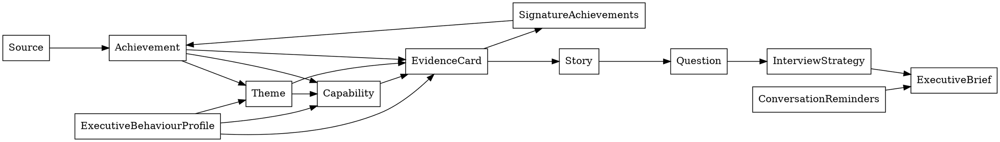

# Sprint 3 — Executive Coaching & Knowledge Intelligence (v0.3) Design

**Status:** Draft, awaiting user review
**Date:** 2026-07-30
**Author:** Brainstorming session (Claude + Alexandre Franco)
**Sprint baseline:** `docs/requirements-spec/requirements-spec-sprint-3.md`
**Builds on:** v0.2 (`docs/superpowers/specs/2026-07-29-interview-playbook-generator-design.md` and the shipped v0.2 codebase)

---

## 1. Purpose and scope

### 1.1 Purpose

Transform the Interview Playbook Generator from a document generator into an **executive interview coaching system**. The output enables a candidate to prepare for an executive interview in under ten minutes by surfacing the right evidence, narratives, coaching guidance, and opportunity-specific positioning from a shared evidence base.

**Architectural intent (R10):** The OKF bundle contains only canonical career knowledge. Opportunity-specific interpretation, coaching intelligence, and presentation artefacts are always derived at execution time and are never persisted as canonical knowledge. Sprint 3 refines the v0.2 architecture into three explicit layers (Knowledge / Coaching / Projection, §2.1) so that Sprint 4 projections (Resume, Cover Letter, LinkedIn, Executive Biography, Consulting Proposal — R11) can consume the same canonical bundle without introducing additional opportunity-specific state.

### 1.2 In scope for v0.3

- 3 new bundle concept types (`ExecutiveBehaviourProfile`, `Capability`, `SignatureAchievements`), all canonical-layer.
- 6 new frontmatter fields on `EvidenceCard` (`conversation_hook`, `transition_sentence`, `organisational_impact`, `strategic_significance`, `recency`, `duplicates_of`).
- 1 new edge pattern in the bundle (`Story → Question` mapping, emitted in the coaching layer).
- 3 new producer Skills (`behaviour-profile-generator`, `capability-extractor`, `signature-achievements-curator`).
- 2 modified Skills (`evidence-card-generator`, `interview-strategy-generator`).
- 2 new views (`out/executive-brief.md`, `out/opportunity-alignment.md`), each produced by a dedicated view Skill.
- A duplicate-detection pass on `evidence-card-generator`.
- A `Capability` node schema with Primary / Supporting / Additional evidence tiers (R3) and an Evidence-strength classification (R7).
- An Interview Mindset section in the Executive Brief (R6).

### 1.3 Out of scope for v0.3 (binding guardrails)

The following are explicitly deferred and must not be added in v0.3:

- Competency ontology / catalogue
- View generator (stage-specific packs: Recruiter / CTO / AI CoE / Executive)
- Career narrative evolution
- Mock interviews / conversation simulator
- LLM-as-judge evaluation
- Company research / salary research / market intelligence
- Advanced OKF linting
- Voice fingerprint
- Multi-target support
- Automated story sequencing across multiple stories

The guiding principle: every Sprint 3 change must directly improve the quality of executive interview preparation. Optimise for a working coaching system, not a complete career intelligence platform.

---

## 2. Architecture

### 2.0 Load-bearing principle

**The OKF bundle contains only canonical career knowledge.** Opportunity-specific interpretation, coaching intelligence, and presentation artefacts are always derived at execution time and are never persisted as canonical knowledge.

This principle is the headline statement that drives every other architectural decision in v0.3.

### 2.1 The three layers

The system has three layers, each with a distinct responsibility:

| Layer | Responsibility | Persistence | Examples |
|---|---|---|---|
| **Knowledge Layer (canonical)** | Persistent, opportunity-independent, version-controlled career knowledge | Persisted in `okf/` | `EvidenceCard`, `Achievement`, `Capability`, `Theme`, `SignatureAchievements`, `ExecutiveBehaviourProfile` |
| **Coaching Layer (derived)** | Opportunity-specific interpretation; regenerated every run from canonical + target opportunity | Never persisted as canonical | `InterviewStrategy` (with opportunity alignment and Story→Question mapping), Conversation Coaching, Conversation Reminders |
| **Projection Layer (views)** | Pure presentation; read-only walk over canonical + coaching layer | `out/` (gitignored) | `out/playbook.md`, `out/interview-cheatsheet.md`, `out/executive-brief.md`, `out/opportunity-alignment.md` |

**Knowledge Layer rules:**

- Persistent. Opportunity-independent. Version-controlled.
- Every node is evidence-grounded or self-evidently inference.
- Never mutated by a coaching- or projection-layer operation.

**Coaching Layer rules:**

- Derived from canonical knowledge plus the target opportunity.
- Regenerated every execution of the pipeline.
- Never treated as source material. If a coaching artefact is needed again, re-derive it from the canonical bundle.
- Does not mutate the canonical bundle.

**Projection Layer rules (the projection contract, R9):**

- Inputs: Canonical Bundle + Target Opportunity + Configuration.
- Output: Presentation artefact.
- Constraints:
  - Read-only access to the canonical bundle.
  - No mutation of any layer.
  - No persistence of the view itself (the view is regenerated each run; only `out/` is written).
  - Fully reproducible: same inputs → same output, modulo non-deterministic prose.

The bundle's spine grows by one edge (`Achievement → Capability`) and one node family (`Capability`). Two new cross-cutting canonical nodes: `ExecutiveBehaviourProfile` (a profile-style summary) and `SignatureAchievements` (a curated list). New coaching-layer additions: opportunity alignment in `InterviewStrategy` and the Story→Question mapping edges. New projection-layer additions: `executive-brief-view` and `opportunity-alignment-view`.

### 2.2 Pure additive release

v0.3 is a pure additive release over v0.2. No v0.2 Skill is rewritten. No v0.2 concept type changes shape. No v0.2 view is removed.

| Kind | What |
|---|---|
| New concept types | `ExecutiveBehaviourProfile`, `Capability`, `SignatureAchievements` |
| New frontmatter fields on `EvidenceCard` | `conversation_hook`, `transition_sentence`, `organisational_impact`, `strategic_significance`, `recency` (canonical only; no opportunity-specific field) |
| New edge pattern | `Story → Question` (mapping edges in interview-strategy) |
| New Skills | `behaviour-profile-generator`, `capability-extractor`, `signature-achievements-curator`, `executive-brief-view`, `opportunity-alignment-view` |
| Modified Skills | `evidence-card-generator` (new fields + dup detection), `interview-strategy-generator` (opportunity-alignment + Story→Question mapping) |
| New bundle sub-tree | `okf/capabilities/` (new directory of `Capability` nodes) |
| New views (output files) | `out/executive-brief.md`, `out/opportunity-alignment.md` |

### 2.3 Updated pipeline order

```
KNOWLEDGE LAYER (canonical; writes to okf/)
  portfolio-ingestor
  portfolio-analyzer
  achievement-extractor
  evidence-card-generator        ← extended (new fields + dup detection)
  behaviour-profile-generator    ← new (canonical)
  capability-extractor            ← new (canonical)
  signature-achievements-curator  ← new (canonical)
  signature-theme-miner
  narrative-generator

COACHING LAYER (derived; reads canonical + target opportunity)
  interview-strategy-generator   ← extended (Opportunity Analysis + Story→Question mapping)
  knowledge-gaps

PROJECTION LAYER (views; reads canonical + coaching + target opportunity; writes to out/)
  playbook-assembler
  opportunity-alignment-view      ← new view Skill
  executive-brief-view           ← new view Skill
```

The orchestrator lists the new Skills in order. Existing v0.2 golden fixtures remain valid because the modified Skill bodies produce additional fields, which is forward-compatible per OKF v0.2 §11.

### 2.4 Bundle spine after Sprint 3



Solid arrows are the existing v0.2 graph; annotations mark Sprint 3 additions. `Capability` joins `Achievement` and `EvidenceCard` (and is reached from `Theme`). `SignatureAchievements` is a list node that points to its chosen members. `Story → Question` is a new mapping edge. `ExecutiveBehaviourProfile` is a cross-cutting node derived from evidence/themes/capabilities. `ExecutiveBrief` (and `ConversationReminders` as a sub-section) is a view, not a node.

---

## 3. OKF schema additions

### 3.1 New concept types

All three new concept types are **canonical-layer** (§2.1, R1). They are persistent, opportunity-independent, and version-controlled. None of them carries opportunity-specific data; opportunity interpretation happens in the coaching and projection layers.

**`ExecutiveBehaviourProfile`** — single concept file at `okf/behaviour-profile.md`. Seven dimensions split into core and optional (R5): **core** (always generated) — Leadership Style, Communication Style, Decision Style, Delivery Style; **optional** (only when sufficient evidence exists; otherwise omitted entirely, not marked insufficient) — Stakeholder Style, Collaboration Style, Executive Presence. Each section: 3–7 `[evidence]` lines (each citing at least one evidence card) followed by 1–3 `[inference]` lines. Missing optional dimensions are surfaced to `knowledge-gaps.md`.

**`Capability`** — `okf/capabilities/<capability-slug>.md`, one per capability. ~10–15 nodes total (5–15 hard band). Each must be grounded in ≥2 sources (evidence cards or themes). Body: Definition, **Primary Evidence** (R3), **Supporting Evidence** (R3), **Additional Evidence** (R3), Demonstrated in achievements, Mapped to themes, **Evidence strength** (R7). Index file `okf/capabilities/index.md` lists all capabilities. Opportunity alignment is *not* part of this node — it is computed in `opportunity-alignment-view` at view time.

**`SignatureAchievements`** — single concept file at `okf/signature-achievements.md`. A curated list of 5–12 `Achievement` nodes, ranked by composite score over *intrinsic* properties only (R2): strategic significance + organisational impact + capability breadth + recency + confidence. Body: the list with per-item Why / Strategic / Capability classification, plus a Selection rationale section. Opportunity-aware reordering happens at view time.

### 3.2 New frontmatter fields on `EvidenceCard`

Six new fields, all additive (forward-compatible per OKF v0.2 §11). Per the layer discipline (§2.1, R2, R10), none of these fields is opportunity-specific — the canonical evidence card stays the same across all target opportunities.

```yaml
conversation_hook: "This reminds me of a programme we delivered at BBC…"   # how to *enter* the story
transition_sentence: "That experience naturally led into my work establishing AI governance."  # how to *leave* the story
organisational_impact: "[inference] Affected ~500 people across three regions; quantified impact unknown."
strategic_significance: "[inference] Anchored the company's multi-year platform strategy."
recency: "2024-08"
duplicates_of: []  # optional; populated by the duplicate-detection pass
```

**`conversation_hook`** is a single sentence in second-person imperative, generated by the Skill using surrounding context. It gives the candidate a natural conversational entry into the story.

**`transition_sentence`** is a single sentence in second-person imperative, generated by the Skill using surrounding context. It gives the candidate a natural exit from the story into the next discussion. Together, the hook and transition form a *conversational frame* around the story.

**`organisational_impact`** and **`strategic_significance`** are inline-classified text using the four project markers. They describe intrinsic properties of the evidence, not properties relative to any opportunity.

**`recency`** is a structured date (YYYY-MM or YYYY-MM-DD), defaulting to the achievement's source date.

**`duplicates_of`** is populated by the duplicate-detection pass (§3.4).

> **No `opportunity_relevance` field on canonical evidence cards** (R2, R10). Opportunity-specific interpretation is computed at view time (in `opportunity-alignment-view` and `interview-strategy-generator`), not stored in the canonical bundle. This keeps the bundle stable across target opportunities.

### 3.3 New edge pattern: Story → Question

`interview-strategy-generator` emits a `Story-to-Question Mapping` section: for each anticipated question (10–15 across major themes), a structured block naming the Primary story (`[recommendation]`), Supporting evidence (`[inference]`), and Alternative story (`[recommendation]`). The edges are realised as bundle-relative markdown links from the question block to the evidence cards.

### 3.4 Duplicate detection

`evidence-card-generator` runs a post-processing pass after generating new cards:

1. Load all existing `okf/evidence/*.md` (excluding new ones).
2. For each new card, compute source overlap (shared `sources[].id`) and token overlap on Situation + Actions sections (≥40% threshold).
3. If both conditions hold, set `duplicates_of: [<existing-slug>]` in frontmatter and leave `status: draft`.
4. Append a one-line entry to `okf/knowledge-gaps.md` listing duplicates for user review.

---

## 4. New Skills

### 4.1 `behaviour-profile-generator`

- **Reads:** `okf/evidence/*.md`, `okf/themes/*.md`, `okf/signature-themes.md` (if present), target opportunity from `config/config.yaml`.
- **Writes:** `okf/behaviour-profile.md` (single `ExecutiveBehaviourProfile` concept).
- **Dimensions** (per R5): **Core** (always generated) — Leadership Style, Communication Style, Decision Style, Delivery Style. **Optional** (only when sufficient evidence exists) — Stakeholder Style, Collaboration Style, Executive Presence. Optional dimensions are *omitted* (the section does not appear at all) when evidence is thin, not generated as `(insufficient evidence)`. Missing dimensions are surfaced to `knowledge-gaps.md`.
- **Body per dimension:** 3–7 `[evidence]` lines (each citing `[evidence-card:slug]`) followed by 1–3 `[inference]` lines with a `> Reasoning:` blockquote.
- **Lint:** exactly four `##` core sections always present; optional sections appear only when sufficient evidence exists.
- **Stop-and-ask:** fewer than 3 evidence cards → exit and tell user to run earlier Skills first.

### 4.2 `capability-extractor`

- **Reads:** `okf/evidence/*.md`, `okf/themes/*.md`, `okf/signature-themes.md` (if present).
- **Writes:** `okf/capabilities/index.md` and `okf/capabilities/<capability-slug>.md` (one per capability).
- **Algorithmic notes:** group by topical affinity; aim for 5–15 capabilities total (≤15 hard cap); each capability must be grounded in ≥2 sources (or 1 evidence + 1 theme/achievement); a capability with no grounding is rejected.
- **Body per capability** (per R3, R7):

  ```markdown
  # Definition
  [inference] One-paragraph description of what this capability means for the candidate.

  # Primary Evidence
  - [Evidence: <title>](<bundle-relative link>) — [inference] brief on why this is the strongest demonstration.
  - [Evidence: ...]

  # Supporting Evidence
  - [Evidence: <title>](<bundle-relative link>) — [inference] brief on how this reinforces the capability.

  # Additional Evidence
  - [Evidence: <title>](<bundle-relative link>) — [inference] brief on how this extends the capability into adjacent areas.

  # Demonstrated in achievements
  - [Achievement: <title>](<bundle-relative link>)

  # Mapped to themes
  - [Theme: <title>](<bundle-relative link>)

  # Evidence strength
  [inference] High / Moderate / Low based on breadth and depth of primary + supporting evidence.
  ```

  Evidence ranking is deterministic, based on: organisational impact, strategic significance, breadth of capability, confidence. This ranking is reusable across all future projections and views (the primary tier is the candidate's lead story for this capability).

- **Lint:** each capability has ≥2 sources-or-equivalent; Primary tier must contain at least 1 evidence card; Supporting and Additional tiers may be empty if evidence is thin (but Primary must not be).
- **Stop-and-ask:** fewer than 5 evidence cards → exit; target opportunity is in a markedly different domain → ask whether to proceed.

### 4.3 `signature-achievements-curator`

- **Reads:** `okf/achievements/*.md`, `okf/capabilities/*.md`, `okf/themes/*.md`. (Does **not** read the target opportunity, per R2/R10 — opportunity-aware reordering happens at view time in `opportunity-alignment-view`.)
- **Writes:** `okf/signature-achievements.md` (single `SignatureAchievements` concept).
- **Selection algorithm:** composite score over *intrinsic* properties: strategic significance + organisational impact + capability breadth + recency + confidence. The list is 5–12 entries. If fewer than 5 achievements exist, the Skill exits; if more than 12 produce non-trivial scores, the strongest 10 are kept and the rest are documented as "honourable mentions" in the rationale section.
- **Body:** the list (1–12 entries), each with Why / Strategic / Capability (`[inference]`), plus a Selection rationale section. **No per-opportunity brief in the canonical node** — opportunity-aware curation lives in the projection layer.
- **Lint:** list length 5–12; each entry links to exactly one `Achievement` node; each entry has three required `[inference]` lines.
- **Stop-and-ask:** fewer than 5 achievements → exit.

### 4.4 `evidence-card-generator` (modified — extensions only)

Existing contract preserved. New fields added to each card (see §3.2). New post-processing pass for duplicate detection (see §3.4).

**Backward compatibility for golden fixtures:** v0.2 golden fixtures do not expect the new fields; they remain valid for tests that diff against the v0.2 bundle shape. New v0.3 golden fixtures do expect the new fields; they are used by tests that diff against the v0.3 bundle shape. Both suites pass because the Skill's body is forward-compatible — old outputs are still valid old outputs, new outputs include the new fields.

### 4.5 `interview-strategy-generator` (modified — extensions only)

This Skill produces **coaching-layer output** (R1, R8). It reads the canonical bundle + target opportunity and produces `okf/interview-strategy.md`, which is regenerated every run and never treated as canonical knowledge.

The Skill's body has three sections:

**Opportunity Analysis** (the sub-step named in R8): produces the Opportunity Alignment section — for each major interview theme (5–8 themes), a block with `[evidence]` requirement from JD, `[inference]` why it matters, supporting evidence links, alignment strength, `[recommendation]` what to emphasise, `[recommendation]` what to avoid over-explaining.

**Story-to-Question Mapping** (the new edge pattern in §3.3): for each anticipated question (10–15), a block with Primary story (`[recommendation]`), Supporting evidence (`[inference]`), Alternative story (`[recommendation]`). The Primary story is selected from the `Capability.Primary Evidence` tier when one matches.

**Existing strategy content** is preserved (the v0.2 strategy sections remain unchanged).

The Skill does not mutate any canonical node. The output file lives in the canonical directory (`okf/interview-strategy.md`) because it is treated as the authoritative coaching artefact for the run, but its content is purely derived and is regenerated every pipeline execution.

### 4.6 `opportunity-alignment-view` (new view Skill)

- **Reads:** `okf/evidence/*`, `okf/themes/*`, `okf/capabilities/*`, `okf/signature-achievements.md`, target opportunity.
- **Writes:** `out/opportunity-alignment.md`. The view's frontmatter uses `title` and `description` only (no `type`) because the file is a *view* in `out/`, not a concept in the OKF bundle. OKF v0.2 §11 requires `type` only on concept files; views are exempt.
- **Body:** 5–8 theme-by-theme blocks; each contains the JD requirement, why it matters, supporting evidence, capability mapping, what to emphasise, what to avoid. Sections: Coverage summary, Signature Achievement mapping.
- **Length:** 3000–5000 words. Designed for the *preparation* window (the week before).

### 4.7 `executive-brief-view` (new view Skill)

- **Reads:** whole bundle (`okf/evidence/*`, `okf/themes/*`, `okf/capabilities/*`, `okf/signature-achievements.md`, `okf/interview-strategy.md`, `okf/behaviour-profile.md`, `okf/signature-themes.md`, `okf/executive-narrative.md`).
- **Writes:** `out/executive-brief.md`.
- **Body (11 sections, per R6):** Executive Positioning, Top 5 Messages, Three Signature Stories, Executive Behaviour Profile (at-a-glance), Conversation Strategy, Risks, Opportunity Watch-outs, Questions to Ask, Conversation Reminders, **Interview Mindset** (R6 — pure coaching, no evidence, ≤5 bullets), Final Reminders.
- **Length:** ≤2,500 words. Designed for the *10-minute pre-interview* window.
- **Link integrity:** every link to an evidence card, capability, achievement, or theme is a working bundle-relative link (lint pass checks).

---

## 5. Why two new view Skills, not extensions of `playbook-assembler`

`playbook-assembler` already has a rich output contract from v0.2. Adding two more output formats to it compounds its complexity without justification. The decision to ship two new view Skills is deliberate:

1. **Single responsibility.** Each view Skill has one output file and one golden fixture.
2. **Composability.** A v0.4 view-generator Skill follows the same pattern.
3. **Testability.** Smaller pieces, faster to iterate.

The existing `out/playbook.md` and `out/interview-cheatsheet.md` are unchanged. A one-line "Related artefacts" footer may reference the new views.

---

## 6. Lint discipline for new Skills

The existing `tests/test_lint.py` is extended (not rewritten) to validate the new concept types and new fields. New tests:

- `tests/test_capability_lint.py` — every `Capability` node has ≥2 sources-or-equivalent.
- `tests/test_behaviour_profile_lint.py` — exactly four core dimensions are always present (Leadership, Communication, Decision, Delivery); optional dimensions are present only when sufficient evidence exists. Optional dimensions are never marked `(insufficient evidence)` — they are omitted entirely.
- `tests/test_signature_achievements_lint.py` — list length is 5–12; each entry has the three required `[inference]` lines.
- `tests/test_executive_brief_view.py` — every link resolves; length ≤2,500 words.
- `tests/test_opportunity_alignment_view.py` — every link resolves; 5–8 themes covered.

The new lint checks live in the same patterns as the existing tests; same fixtures, same `pytest` style.

---

## 7. Migration path

The migration is non-disruptive. v0.2 continues to work throughout.

**Step 1: Schema docs.** Update `docs/superpowers/specs/2026-07-29-interview-playbook-generator-design.md` §5.2 to add the three new concept types. Update `AGENTS.md` and `CLAUDE.md` with the new concept types and the new fields on `EvidenceCard`. Commit as docs-only.

**Step 2: Extend `evidence-card-generator`.** Add the five new fields and the duplicate-detection pass. Regenerate the golden fixture. Existing v0.2 tests still pass (new fields are additive).

**Step 3: Implement the three new Skills.** `capability-extractor` first, `signature-achievements-curator` second, `behaviour-profile-generator` third. Each ships with `SKILL.md`, fixture, golden, snapshot test.

**Step 4: Extend `interview-strategy-generator`.** Add Opportunity Alignment and Story-to-Question Mapping sections. Regenerate the golden.

**Step 5: Implement the two new views.** `opportunity-alignment-view` first, then `executive-brief-view`. Each ships with its `SKILL.md`, fixture, golden, snapshot test.

**Step 6: Update the orchestrator.** Add the 5 new Skills to the pipeline order in `config/config.example.yaml` and `config/config.yaml`. Update `AGENTS.md` and `CLAUDE.md` with the new pipeline.

**Step 7: Update docs.** Add the v0.3 section to `README.md`. Update the architecture diagram in `ARCHITECTURE.md` to include the new nodes and views.

**Step 8: Bump the version.** `version: "0.3"` in both YAML configs. Conventional commits.

No step requires touching v0.2 Skills. Blast radius is contained.

---

## 8. Success criteria for v0.3

Sprint 3 is "done" when **all** of the following are true:

1. The pipeline runs end-to-end on the example portfolio. A fresh run produces the v0.2 outputs unchanged + the new bundle nodes + the two new views, without manual intervention.
2. Every new concept type is present in the bundle. `find okf -name "*.md" | xargs grep -l "^type: Capability$"` returns ≥5 files; the same for `ExecutiveBehaviourProfile` (1) and `SignatureAchievements` (1).
3. Every evidence card has the new fields. `grep -L "^conversation_hook:" okf/evidence/*.md | xargs grep -L "^transition_sentence:"` returns empty (duplicates are exempt; new fields default to `null` or empty if the Skill can't generate them).
4. The Executive Brief is generated and link-clean. `out/executive-brief.md` exists, every link resolves, the brief is ≤2,500 words.
5. The opportunity alignment view is generated. `out/opportunity-alignment.md` exists, covers 5–8 themes, every link resolves.
6. Snapshot tests pass. All five new Skills (3 producer Skills + 2 view Skills) plus the two modified Skills have green tests against their golden fixtures. The original v0.2 tests still pass.
7. The pipeline is backward-compatible. Running the v0.2 pipeline on a v0.2-shaped config produces the same bundle structure as before. New fields default to `null` or empty if the Skill can't generate them.
8. The never-fabricate list is still enforced. A test case where a fixture deliberately omits a transition sentence produces a card with `[recommendation]` placeholder, not a fabricated sentence.
9. `knowledge-gaps.md` reports duplicates. When the duplicate-detection pass finds overlapping cards, the report lists them with the user in the loop.
10. The Skills work in both Claude Code and Antigravity. Each new `SKILL.md` uses only the conventional Skills frontmatter and instructions, no Claude-Code-only syntax.

---

## 9. Risks

| Risk | Likelihood | Mitigation |
|---|---|---|
| New Skills drift in classification discipline over time | Medium | The lint pass is shared; new Skills use the same `tests/test_lint.py` patterns. |
| `capability-extractor` produces too many or too few capabilities | Medium | Hard limits (≥5, ≤15). The orchestrator surfaces the count to the user. |
| `signature-achievements-curator` ranking is opaque | Medium | The "Selection rationale" section explains the algorithm. The user can re-rank manually by editing the list. |
| `behaviour-profile-generator` infers unsupported dimensions | High (LLM tendency) | Per R5, optional dimensions are *omitted* (not marked insufficient) when sources are thin. The core-dimension lint requires `[evidence]` backing. The never-fabricate list is enforced. |
| The Executive Brief duplicates content from `playbook.md` and `interview-cheatsheet.md` | High | Intentional but bounded. The brief is the only artefact designed for the 10-minute window. Documented in `AGENTS.md`. |
| `evidence-card-generator` extension breaks existing v0.2 golden fixtures | Low | New fields are additive; old fixtures don't expect them. New fixtures do expect them. Both pass. |
| `out/executive-brief.md` becomes a parallel source of truth over time | Medium | The brief is never committed; it lives in `out/` and is regenerated. The bundle is the source of truth. |
| Users confuse Signature Achievements with achievements | Medium | Document carefully in `AGENTS.md`. Signature Achievements is a list node, not a parallel hierarchy. |
| Sprint 3 expands scope creep into view-generator territory | Medium | The view-generator (stage packs) is explicitly v0.4. The two new views are narrowly scoped. |
| `executor.resource`/`attester.resource` confusion with v0.2 OKF Attested Computation | Low | v0.2 doesn't use Attested Computation; the v0.3 spec doesn't either. Documented as out-of-scope. |

---

## 10. Open questions (not blocking v0.3)

Real but not load-bearing for v0.3:

1. **Executive Brief vs. Interview Cheatsheet overlap.** Both aim for "quick review before the interview." Should v0.4 merge them? Or keep them separate with distinct curation?
2. **Voice fingerprint.** The system has no model of the candidate's voice yet. The brief reads in the model's voice, not the candidate's. v0.4?
3. **Behaviour profile verification.** The Behaviour Profile is high-stakes — it's how the candidate is *characterised*. Should verification require a human review before the brief references it? Currently the brief trusts the profile.
4. **Capability lifecycle.** Capabilities are bundled at signature-achievement time. As the career evolves, capabilities drift. Should `capability-extractor` be re-runnable independently of the rest of the pipeline?
5. **Sprint 4 projections** (R11) — Resume, Cover Letter, LinkedIn, Executive Biography, Consulting Proposal will be added in v0.4 and will consume the same canonical bundle. The layer separation in §2.1 makes these forward-compatible without bundle changes, but the projection contract should be re-evaluated as new consumers come online.

---

## Appendix A — Worked example: ExecutiveBehaviourProfile node

```markdown
---
type: ExecutiveBehaviourProfile
title: "Executive Behaviour Profile"
description: "Inferred executive behaviour profile for the current target opportunity. Core dimensions always generated; optional dimensions included only when sufficient evidence exists."
tags: [behaviour, profile, executive]
generated: { by: behaviour-profile-generator/claude-sonnet, at: 2026-07-30T14:00:00Z }
verified: []
status: draft
stale_after: 2026-10-30
sources:
  - id: cv-2024
    resource: evidence/cv.md
    title: CV (2024 edition)
  - id: arch-doc-cloud-migration
    resource: evidence/arch-doc-cloud-migration.md
    title: Architecture Document: Cloud Migration
---

# Core dimensions

## Leadership Style

[evidence] Led the architecture working group across three regions. [evidence-card:cloud-migration-stakeholder-management]
[evidence] Distributed leadership: never named "the leader" in any org chart shown in source. [evidence-card:arch-doc-cloud-migration]
[inference] Leadership is enacted through written artefacts (decision logs, runbooks) rather than positional authority.
> Reasoning: Three sources describe the candidate leading through artefacts, none through reporting-line authority.

## Communication Style

[evidence] Authored migration architecture document and cutover runbook. [evidence-card:arch-doc-cloud-migration]
[inference] Written communication is the primary mode; verbal communication is anchored to written context.
> Reasoning: All major stakeholder interactions captured in writing.

## Decision Style

[evidence] Authored the cutover decision log, recording trade-offs and reversibility assessments. [evidence-card:arch-doc-cloud-migration]
[inference] Decision-making is documented and reversible when possible; the candidate prefers processes over one-way doors.
> Reasoning: The cutover decision log is the strongest evidence; other decision evidence is implied but not stated.

## Delivery Style

[evidence] Migration completed on schedule. [evidence-card:cloud-migration-stakeholder-management]
[evidence] Cutover rehearsed end-to-end before the real window. [evidence-card:arch-doc-cloud-migration]
[inference] Strong delivery discipline; delivery is anchored to rehearsal and runbooks, not improvisation.
> Reasoning: Two corroborating sources confirm the rehearsal pattern.

# Optional dimensions (R5)

## Stakeholder Style

[evidence] Coordinated across three regions. [evidence-card:cloud-migration-stakeholder-management]
[evidence] Documented stakeholder communications in writing. [evidence-card:arch-doc-cloud-migration]
[inference] Stakeholder coordination is multi-region, documented, and asynchronous-first.
> Reasoning: Two sources, both verifiable.

# Omitted optional dimensions

**(Collaboration Style)** — omitted. The portfolio contains no evidence that maps to this dimension. See `knowledge-gaps.md` for the recommended portfolio improvement.

**(Executive Presence)** — omitted. The portfolio does not contain sufficient evidence about how the candidate presents under pressure; the rehearsed-cutover story is suggestive but not direct. See `knowledge-gaps.md`.

## Summary

Well-evidenced (core): Leadership, Communication, Decision, Delivery.
Well-evidenced (optional): Stakeholder.
Omitted (optional): Collaboration, Executive Presence.

The optional dimensions are omitted, not marked `(insufficient evidence)`. The user's knowledge-gaps report captures what would strengthen the profile.
```

---

## Appendix B — Worked example: Executive Brief view

```markdown
---
title: "Executive Brief — Head of AI (Vervaunt)"
description: "10-minute pre-interview briefing."
generated: { by: executive-brief-view/claude-sonnet, at: 2026-07-30T14:00:00Z }
status: draft
---

# Executive Brief
*Generated for Head of AI at Vervaunt · 2026-07-30 · [draft]*

## 1. Executive Positioning
[recommendation] Enterprise architect and platform leader with fifteen years of operationalising transformation across regulated industries; the right person to land Vervaunt's first AI platform in production.

## 2. Top 5 Messages
1. **[inference] Operational, not aspirational.** [Evidence: Cloud Migration](../okf/evidence/cloud-migration.md)
2. **[inference] Governance is the unlock, not the blocker.** [Evidence: Architecture Patterns](../okf/evidence/architecture-patterns.md)
3. **[inference] Lead by artefacts.** [Evidence: Decision Log Practice](../okf/evidence/decision-log-practice.md)
4. **[inference] AI is a delivery problem, not a research problem.** [Evidence: AI CoE Build](../okf/evidence/ai-coe-build.md)
5. **[inference] The capability is in the team, not the individual.** [Evidence: Stakeholder Management](../okf/evidence/stakeholder-management.md)

## 3. Three Signature Stories
1. **[inference] Cloud migration across three regions.** [Evidence: Cloud Migration](../okf/evidence/cloud-migration.md). [inference] Why this is a signature moment: the only programme that survived the post-merger integration.
2. **[inference] Building the AI Centre of Excellence.** [Evidence: AI CoE Build](../okf/evidence/ai-coe-build.md). [inference] First AI capability in production, with governance.
3. **[inference] Architecture patterns governance.** [Evidence: Architecture Patterns](../okf/evidence/architecture-patterns.md). [inference] Mandated patterns across 200+ engineers.

## 4. Executive Behaviour Profile — at-a-glance
- **Leadership:** [inference] Distributed leadership through artefacts.
- **Communication:** [inference] Written-first; verbal anchored to written context.
- **Decision:** [inference] (thin — see knowledge-gaps.md)
- **Delivery:** [inference] Rehearsed, scheduled, predictable.
- **Stakeholder:** [inference] Multi-region coordination with documented decision logs.
- **Executive Presence:** [inference] Calm under pressure, supported by artefacts.

(Decision and Executive Presence are core/optional per R5; Collaboration is omitted because evidence is insufficient.)

## 5. Conversation Strategy
[inference] Lead with Operational, not aspirational. The Vervaunt role is delivery-focused.
[recommendation] Lead with: Cloud migration story.
[recommendation] Avoid over-explaining: technical architecture details.

## 6. Risks
- [inference] Decision Style is thin in evidence — may come across as indecisive.
- [recommendation] Mitigation: use the decision-log story as evidence; have it ready before the interview.
- [inference] Capability is broad; interviewer may probe for depth.
- [recommendation] Mitigation: have one deep story ready for each capability.

## 7. Opportunity Watch-outs
- [inference] The interviewer will probe for AI production-isation, not AI strategy.
- [recommendation] How to handle: lead with the AI CoE build story.

## 8. Questions to Ask
- [recommendation] What does success look like in the first 90 days?
- [recommendation] Where does the Head of AI sit in the engineering org — product, platform, or standalone?
- [recommendation] What is the current state of AI governance in the business?
- [recommendation] Who is the peer set for this role?
- [recommendation] What is the budget envelope for AI in year one?

## 9. Conversation Reminders
[recommendation] Pause. Listen carefully. Answer the question first. Keep responses concise. Use business language. Bring answers back to outcomes. Avoid over-explaining technology. Ask thoughtful questions. Be curious. Finish confidently.

## 10. Interview Mindset  (R6 — pure coaching, no evidence)
[recommendation] Curious.
[recommendation] Collaborative.
[recommendation] Outcome-focused.
[recommendation] Executive.
[recommendation] Commercial.

## 11. Final Reminders
[recommendation] You are interviewing them as much as they are interviewing you.
[recommendation] The role is delivery, not strategy. Lead accordingly.
[recommendation] Trust the artefacts; they have always worked for you.
```

---

## Appendix C — Glossary additions

- **Canonical Layer** — The Knowledge Layer in §2.1. Persistent, opportunity-independent career knowledge stored in the OKF bundle. Examples: `Achievement`, `EvidenceCard`, `Capability`, `Theme`, `SignatureAchievements`, `ExecutiveBehaviourProfile`.
- **Coaching Layer** — Derived layer in §2.1. Regenerated every run from canonical + target opportunity. Never persisted as canonical knowledge. Examples: `InterviewStrategy` (with Opportunity Alignment and Story→Question mapping), Conversation Coaching, Conversation Reminders.
- **Projection Layer** — View layer in §2.1. Read-only walks over canonical + coaching + target opportunity. Output lives in `out/`. Examples: `out/playbook.md`, `out/interview-cheatsheet.md`, `out/executive-brief.md`, `out/opportunity-alignment.md`.
- **Projection contract** — The constraints in §2.1 (R9). Inputs: Canonical Bundle + Target Opportunity + Configuration. Output: Presentation artefact. Read-only access. No mutation. No persistence. Fully reproducible.
- **Behaviour Profile** — A cross-cutting concept type (`ExecutiveBehaviourProfile`) describing the candidate's executive behaviour. Per R5, has four core dimensions (Leadership, Communication, Decision, Delivery — always generated) and three optional dimensions (Stakeholder, Collaboration, Executive Presence — only generated when sufficient evidence exists; otherwise omitted).
- **Capability** — A mid-level abstraction between achievements and themes. Cluster of evidence cards and themes representing a hireable competency (e.g., "Enterprise Architecture"). Concept type `Capability`. Per R3, body has three evidence tiers (Primary, Supporting, Additional) and an Evidence-strength classification (R7) — opportunity relevance is computed at view time, not stored on the node.
- **Signature Achievement** — A curated ranking of 5–12 achievements selected on intrinsic properties (significance, impact, capability breadth, recency, confidence). Concept type `SignatureAchievements`. Per R2, opportunity-aware reordering happens at view time, not in the canonical list.
- **Conversation Hook** — A single sentence on an evidence card (frontmatter `conversation_hook:`) that gives the candidate a natural conversational entry into the story. Pairs with `transition_sentence` (R4) for a full conversational frame.
- **Transition Sentence** — A single sentence on an evidence card that helps the candidate leave the story naturally and move into the next discussion.
- **Executive Brief** — A view (`out/executive-brief.md`) designed for the 10-minute pre-interview window. Walks the bundle; never persisted as a node. Per R6, includes an Interview Mindset section (pure coaching, no evidence, ≤5 bullets) between Conversation Reminders and Final Reminders.
- **Opportunity Alignment** — A view (`out/opportunity-alignment.md`) designed for the preparation window. Theme-by-theme mapping of role requirements to evidence, computed dynamically from canonical + target opportunity (R8).
- **Opportunity Analysis** — A sub-step of `interview-strategy-generator` (R8). Reads canonical bundle + target opportunity and produces the Opportunity Alignment section of the strategy. Never persisted as a separate node.
- **Duplicate Detection** — A post-processing pass in `evidence-card-generator` that flags cards with overlapping sources and narrative as `duplicates_of` an existing card.
- **Interview Mindset** — A pure-coaching section of the Executive Brief (R6). No evidence backing; ≤5 bullets capturing the candidate's mindset for the interview (e.g., Curious, Collaborative, Outcome-focused, Executive, Commercial).
