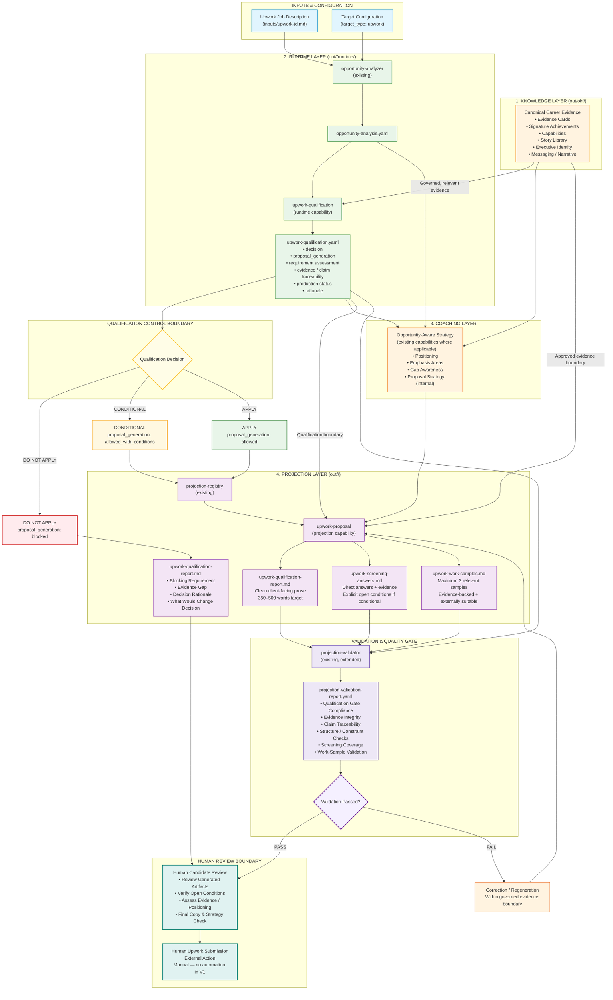

# Upwork Target Flow Architecture

This diagram visualizes the end-to-end processing pipeline for an Upwork opportunity across the platform's 4 architectural layers, qualification control boundary, validation gate, and human review boundary.

## Key Architectural Invariants

1. Four-Layer Architecture: Upwork processing conforms to the existing Knowledge, Runtime, Coaching, and Projection layers. Validation is a cross-cutting quality gate, not a fifth architectural layer.
2. Qualification Control Boundary: Qualification is a hard downstream control. Proposal projection cannot override the qualification result:
    * DO NOT APPLY → proposal_generation: blocked
    * CONDITIONAL → proposal_generation: allowed_with_conditions
    * APPLY → proposal_generation: allowed
3. Qualification Evidence vs Projection Evidence: Qualification determines whether the opportunity can legitimately be pursued. Projection selects persuasive evidence only within the evidence boundary established by qualification.
4. Production Evidence Integrity: Production experience, prototype/innovation experience, personal projects, and theoretical knowledge remain explicitly distinct. The system must never infer production status from technical similarity or sophistication.
5. Single Source of Career Evidence: Canonical career evidence remains in the OKF Knowledge Layer. The Upwork feature does not create a second career or evidence repository.
6. Clean Client Prose: upwork-qualification-report.md contains natural, professional client-facing prose. Internal provenance, evidence relationships, validation metadata, and qualification state remain in structured/runtime context rather than being exposed as machine-readable tags in the proposal.
7. DO NOT APPLY Is Not a Failure: A blocked opportunity produces a qualification/gate report, not a submission-ready proposal. The gate report is deliberately separate from upwork-qualification-report.md.
8. Validation Is a Quality Gate: All projection artifacts—including the proposal, screening answers, and work-sample recommendations—pass through projection-validator before reaching human review.
9. Validation Failure Does Not Bypass Governance: Failed outputs return for correction/regeneration within the same qualification and evidence boundaries. Validation cannot expand the evidence boundary or change the qualification decision.
10. Human Review Boundary: The system ends with human-reviewable artifacts. Final submission to Upwork remains a human action. No automated browser interaction, scraping, or proposal submission is performed in V1.
11. CAS / SLDC Governance: Processing is bounded, evidence-grounded, traceable, deterministic where applicable, and integrated with the existing repository lifecycle and validation mechanisms.
