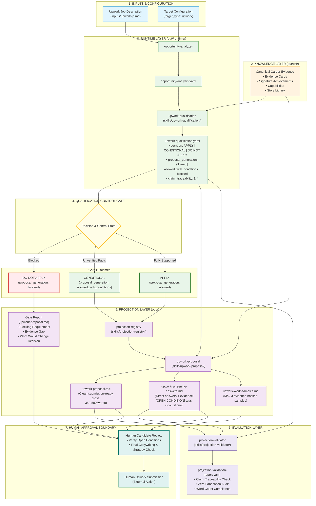

# Upwork Target Flow Architecture

This diagram visualizes the end-to-end processing pipeline for an Upwork opportunity across the platform's 4 architectural layers, control gate boundaries, and human review interface.

## Key Architectural Invariants

1. **Qualification Control Gate**: Proposal generation CANNOT override qualification. If qualification evaluates to `DO NOT APPLY`, proposal generation is blocked and renders a Gate Report instead of a submission-ready application.
2. **Clean Client Prose**: `upwork-proposal.md` is rendered as clean professional prose ready for marketplace copy-pasting, while full claim-to-evidence provenance is preserved in `out/<target-slug>/runtime/upwork-qualification.yaml`.
3. **Automated Provenance Audit**: `projection-validator` verifies claim traceability internally by matching generated claims against the `claim_traceability` array in runtime context.
4. **Human Review Boundary**: The system ends at human-reviewable artifacts. No automated Upwork browser interaction or proposal submission is performed.
