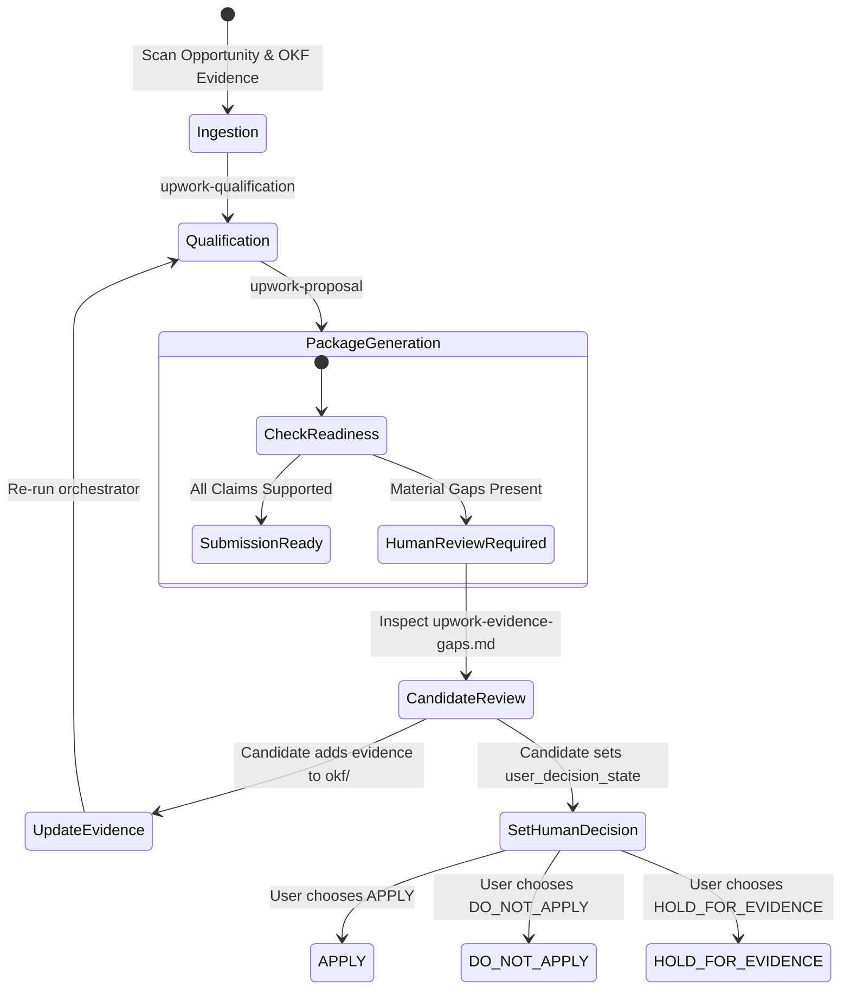

# Phase 1 Data Model: Upwork Proposal Generator V2.1

## Entities & Schemas

### 1. RequirementEvidenceAssessment

Captures the evaluation of a material opportunity requirement against canonical OKF evidence.

```yaml
requirement_id: "req-01"
requirement_text: "Personal implementation of production multi-agent system in a real company"
classification: "SUPPORTED | PARTIALLY_SUPPORTED | UNKNOWN | CONTRADICTED"
is_dealbreaker: true # whether explicit hard disqualifier
missing_facts:
  - "production_deployment_verification"
  - "agent_count"
established_facts:
  - "Multi-agent architecture design"
  - "Prototype/innovation implementation at Enterprise X"
matched_evidence_ids:
  - "card-enterprise-ai-01"
candidate_confirmation_questions:
  - question_id: "q-01"
    question_text: "Was the multi-agent system deployed into live production for Enterprise X?"
    missing_fact: "production_deployment_verification"
    impact: "Required to satisfy client production dealbreaker"
rationale: "Canonical evidence verifies architecture design and prototype, but production deployment is unrecorded."
```

### 2. UpworkQualificationContext (`out/<target-slug>/runtime/upwork-qualification.yaml`)

The machine-readable execution context produced by `upwork-qualification` and consumed by `upwork-proposal` and `projection-validator`.

```yaml
version: "2.1"
generated_at: "2026-09-10T16:00:00Z"
target_slug: "upwork-senior-agentic-ai-architect"
opportunity_title: "Senior Agentic AI Architect"

# Machine Recommendation (Decoupled from human decision)
machine_recommendation: "STRONG_FIT | POTENTIAL_FIT | EVIDENCE_GAPS | WEAK_FIT | CLEAR_MISMATCH"
recommendation_rationale: "Core architecture skills supported; production deployment status is unresolved."

# Content Mode & Submission Readiness
proposal_content_mode: "EVIDENCE_BACKED | EVIDENCE_GAPS | HUMAN_REVIEW_REQUIRED"
submission_readiness: "SUBMISSION_READY | HUMAN_REVIEW_REQUIRED"

# Human User Decision State (Defaults unforced)
user_decision_state: "APPLY | DO_NOT_APPLY | HOLD_FOR_EVIDENCE" # Set by user, not forced by machine

# Requirement Assessments
requirement_assessments:
  - requirement_id: "req-01"
    requirement_text: "Personal implementation of production multi-agent system in a real company"
    classification: "UNKNOWN"
    is_dealbreaker: true
    missing_facts: ["production_deployment_verification"]
    established_facts: ["Multi-agent architecture design"]
    matched_evidence_ids: ["card-enterprise-ai-01"]

# Missing Facts & Confirmation Questions
evidence_gaps:
  - gap_id: "gap-01"
    requirement_id: "req-01"
    missing_fact: "production_deployment_verification"
    confirmation_question: "Was the multi-agent system deployed into live production for Enterprise X?"

# Claim Traceability (Used by projection-validator)
claim_traceability:
  - claim: "Designed multi-agent governance architecture for enterprise workflow automation"
    evidence_id: "card-enterprise-ai-01"
    classification: "evidence"
    source_reference: "inputs/cv.pdf"
```

### 3. UpworkHumanReviewPackage (Output Artifacts)

The multi-artifact collection generated in `out/<target-slug>/`:

| Artifact | File Path | Content Purpose | Target Audience |
|----------|-----------|-----------------|-----------------|
| Proposal Draft | `out/<target-slug>/upwork-qualification-report.md` | Clean, copy-pasteable executive proposal prose (no footnote tags or internal diagnostics) | Client / Candidate |
| Evidence Gap Report | `out/<target-slug>/upwork-evidence-gaps.md` | Detailed breakdown of established facts, missing facts, and candidate confirmation questions | Candidate Review |
| Screening Answers | `out/<target-slug>/upwork-screening-answers.md` | Direct evidence-safe responses to client screening questions | Client / Candidate |
| Recommended Work Samples | `out/<target-slug>/upwork-work-samples.md` | Up to 3 evidence-backed work sample recommendations with explicit project type tags | Client / Candidate |

### 4. Lifecycle & State Transitions


