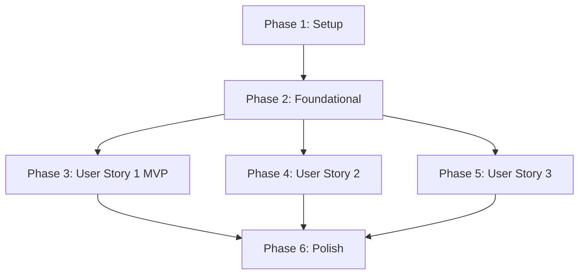

# Tasks: Human-Owned Opportunity Decision & Evidence-Gap Handling (Upwork Proposal Generator V2.1)

**Feature Branch**: `002-upwork-proposal-refinements`  
**Specification**: [spec.md](file:///Users/avfranco/GitHub/interview-playbook-generator/specs/002-upwork-proposal-refinements/spec.md)  
**Implementation Plan**: [plan.md](file:///Users/avfranco/GitHub/interview-playbook-generator/specs/002-upwork-proposal-refinements/plan.md)  

---

## Phase 1: Setup (Shared Infrastructure)

**Purpose**: Verify baseline repository state and initialize feature environment.

- [x] T001 Setup feature specification and design baseline in `specs/002-upwork-proposal-refinements/`
- [x] T002 [P] Verify environment and test suite baseline via `pytest tests/test_upwork_proposal_generator.py`

---

## Phase 2: Foundational (Blocking Prerequisites)

**Purpose**: Core schema and data model updates required before implementing user stories.

- [x] T003 Update V2.1 data structures and schema definitions in `skills/upwork-qualification/SKILL.md` for 4-tier requirement assessment (`SUPPORTED`, `PARTIALLY_SUPPORTED`, `UNKNOWN`, `CONTRADICTED`)
- [x] T004 [P] Define V2.1 artifact header and `submission_readiness` schema (`SUBMISSION_READY`, `HUMAN_REVIEW_REQUIRED`) in `skills/upwork-proposal/SKILL.md`

---

## Phase 3: User Story 1 - Evidence-Safe Proposal & Review Generation for Incomplete Evidence (Priority: P1) 🎯 MVP

**Goal**: Generate complete, evidence-safe proposal drafts and companion evidence-gap reports for opportunities with unknown or partially supported requirements without fabricating assertions or auto-blocking output generation.

**Independent Test**: Run qualification and proposal projection on an opportunity with an unknown production requirement. Verify `upwork-qualification.yaml` surfaces the gap, proposal draft contains no fabricated claims, `upwork-evidence-gaps.md` details missing facts and confirmation questions, and status is set to `HUMAN_REVIEW_REQUIRED`.

### Tests for User Story 1

- [x] T005 [P] [US1] Write test cases for incomplete evidence & dealbreaker gap handling in `tests/test_upwork_proposal_generator.py`

### Implementation for User Story 1

- [x] T006 [US1] Implement 4-tier requirement evaluation and missing-fact extraction in `skills/upwork-qualification/SKILL.md`
- [x] T007 [US1] Implement candidate confirmation question generator for `UNKNOWN` and `PARTIALLY_SUPPORTED` requirements in `skills/upwork-qualification/SKILL.md`
- [x] T008 [US1] Implement clean client-facing proposal prose renderer (with `PARTIALLY_SUPPORTED` qualification rules) in `skills/upwork-proposal/SKILL.md`
- [x] T009 [US1] Implement companion Evidence Gap Report (`upwork-evidence-gaps.md`) renderer in `skills/upwork-proposal/SKILL.md`
- [x] T010 [US1] Implement evidence-safe screening answer generator (qualifying unresolved questions without fabricated yes/no answers) in `skills/upwork-proposal/SKILL.md`
- [x] T011 [US1] Update work sample selector to retain explicit project type labels (`personal_project`, `prototype_innovation`, `client_production`) in `skills/upwork-proposal/SKILL.md`

**Checkpoint**: User Story 1 (MVP) complete and testable independently.

---

## Phase 4: User Story 2 - Human-Owned Decision Workflow & State Separation (Priority: P2)

**Goal**: Decouple machine fit recommendations from final human application decision states, ensuring the machine acts as a copilot without forcing application decisions.

**Independent Test**: Process an opportunity with evidence gaps. Verify `upwork-qualification.yaml` records `machine_recommendation: EVIDENCE_GAPS` while `user_decision_state` remains unforced and distinct for the human user to decide (`APPLY`, `DO_NOT_APPLY`, `HOLD_FOR_EVIDENCE`).

### Tests for User Story 2

- [x] T012 [P] [US2] Write test cases for decoupled machine recommendation vs human decision state in `tests/test_upwork_proposal_generator.py`

### Implementation for User Story 2

- [x] T013 [US2] Implement machine fit recommendation logic (`STRONG_FIT`, `POTENTIAL_FIT`, `EVIDENCE_GAPS`, `WEAK_FIT`, `CLEAR_MISMATCH`) in `skills/upwork-qualification/SKILL.md`
- [x] T014 [US2] Update `upwork-qualification.yaml` schema and header rendering to record unforced `user_decision_state` (`APPLY`, `DO_NOT_APPLY`, `HOLD_FOR_EVIDENCE`) in `skills/upwork-proposal/SKILL.md`

**Checkpoint**: User Story 2 complete and testable independently.

---

## Phase 5: User Story 3 - Evidence Improvement Loop & Deterministic Regeneration (Priority: P3)

**Goal**: Enable candidates to update canonical OKF evidence and deterministically regenerate `HUMAN_REVIEW_REQUIRED` artifacts into `SUBMISSION_READY` proposals without manual text edits.

**Independent Test**: Update canonical OKF evidence with a missing fact, re-run the pipeline, and verify `submission_readiness` updates to `SUBMISSION_READY` and proposal prose incorporates the evidence.

### Tests for User Story 3

- [x] T015 [P] [US3] Write test cases for evidence improvement loop & `projection-validator` rules in `tests/test_upwork_proposal_generator.py`

### Implementation for User Story 3

- [x] T016 [US3] Implement deterministic proposal re-evaluation and readiness upgrade in `skills/upwork-proposal/SKILL.md`
- [x] T017 [US3] Extend automated validation rules in `skills/projection-validator/SKILL.md` for claim traceability, zero fabrication, clean prose, and readiness alignment

**Checkpoint**: User Story 3 complete and testable independently.

---

## Phase 6: Polish & Cross-Cutting Concerns

- [x] T018 [P] Update pipeline orchestrator integration in `skills/playbook-orchestrator/SKILL.md`
- [x] T019 Run full Pytest regression suite (`tests/test_upwork_proposal_generator.py`) and quickstart validation guide (`specs/002-upwork-proposal-refinements/quickstart.md`)

---

## Dependencies & Execution Order

---

## Parallel Execution Opportunities

- `T002` (baseline verification) can run in parallel with `T001`.
- `T004` (readiness schema in `skills/upwork-proposal/SKILL.md`) can run in parallel with `T003` (4-tier assessment in `skills/upwork-qualification/SKILL.md`).
- `T005` (US1 tests), `T012` (US2 tests), and `T015` (US3 tests) can be drafted in parallel once Foundational phase completes.
- `T018` (orchestrator integration) can run in parallel with `T017` (validator extension).

---

## Implementation Strategy (MVP First)

1. Complete **Phase 1: Setup** and **Phase 2: Foundational**.
2. Complete **Phase 3: User Story 1 (MVP)**.
3. **STOP & VALIDATE**: Run `pytest tests/test_upwork_proposal_generator.py` to confirm US1 functionality independently.
4. Complete **Phase 4 (US2)** and **Phase 5 (US3)** incrementally.
5. Complete **Phase 6: Polish** and perform final validation against `quickstart.md`.
