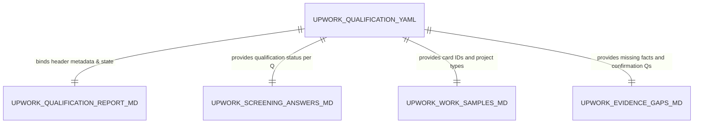

# Data Model & Schema Definitions: Upwork Proposal Generator (V3.2 Alignment)

## Overview

Defines the entity schemas, file locations, metadata headers, and structural invariants for the V3.2 Upwork Proposal Projection suite.

---

## Artifact Schemas

### 1. Executive Proposal Artifact (`out/<target-slug>/upwork-qualification-report.md`)

- **Role**: Clean client-facing Executive Proposal / Cover Letter draft.
- **Format**: Markdown with YAML frontmatter.
- **Target Length**: 350–500 words (excluding frontmatter and header block).
- **Clean Prose Guarantee**: Zero visible `[evidence]`, `[inference]`, `[^source-id]`, or `[OPEN CONDITION]` tags.

#### Schema Structure:

```markdown
---
type: UpworkQualificationReport
target_slug: "<target-slug>"
sources:
  - id: cv-2024
    resource: inputs/cv.pdf
    title: Candidate CV
    author: human:alexandre.franco
---

# Upwork Proposal: <Target Opportunity Title>

**Submission Readiness**: `<SUBMISSION_READY | HUMAN_REVIEW_REQUIRED>`
**Machine Recommendation**: `<STRONG_FIT | POTENTIAL_FIT | EVIDENCE_GAPS | WEAK_FIT | CLEAR_MISMATCH>`
**User Decision State**: `<APPLY | DO_NOT_APPLY | HOLD_FOR_EVIDENCE>`
**Proposal Content Mode**: `<EVIDENCE_BACKED | EVIDENCE_SAFE_BOUNDED | HUMAN_REVIEW_REQUIRED>`
**Word Count**: <Actual Word Count> (Target: 350-500 words)

---

## Opening & Problem Understanding
<Direct client problem formulation leading with candidate positioning>

## Relevant Experience & Approach
<2-4 requirement-to-proof mappings using bounded attribution phrasing>

## Project Snapshots
<Max 3 project snapshots: Context -> Action -> Operational Relevance>

## Proposed Approach
<Process -> Systems -> Automation -> Controls; using prospective modal verbs>

## Smart Questions
<3-5 strategic scoping questions>

## Call to Action
<Invitation for scoping discussion>
```

---

### 2. Screening Answers Artifact (`out/<target-slug>/upwork-screening-answers.md`)

- **Role**: Evidence-grounded responses to client screening questions.
- **Format**: Markdown with YAML frontmatter.
- **Isolation Rule**: Zero `## Proposal Cover Letter` section; Q&A responses only.

#### Schema Structure:

```markdown
---
type: UpworkScreeningAnswers
target_slug: "<target-slug>"
sources:
  - id: cv-2024
    resource: inputs/cv.pdf
    title: Candidate CV
    author: human:alexandre.franco
---

# Upwork Proposal Screening Responses

## Question 1: <Client Question Text>
**Status**: `<ANSWERED | EVIDENCE_SAFE_QUALIFIED | [OPEN CONDITION: <fact>]>`
**Answer**: <Evidence-backed or bounded response>

## Question 2: <Client Question Text>
**Status**: `<ANSWERED | EVIDENCE_SAFE_QUALIFIED | [OPEN CONDITION: <fact>]>`
**Answer**: <Evidence-backed or bounded response>
```

---

### 3. Work Samples Artifact (`out/<target-slug>/upwork-work-samples.md`)

- **Role**: Recommended evidence-backed case studies / work samples (max 3).
- **Format**: Markdown with YAML frontmatter.

#### Schema Structure:

```markdown
---
type: UpworkWorkSamples
target_slug: "<target-slug>"
sources:
  - id: cv-2024
    resource: inputs/cv.pdf
    title: Candidate CV
    author: human:alexandre.franco
---

# Relevant Work Samples & Case Studies

## 1. <Sample Title>
- **Project Type**: `<client_production | prototype_innovation | personal_project>`
- **Supports Requirement**: <Requirement text>
- **Demonstrated Capability**: <Capability text>
- **Evidence Source**: <card-id>
- **Summary**: <Case study summary>
```

---

### 4. Evidence Gap Report (`out/<target-slug>/upwork-evidence-gaps.md`)

- **Role**: Companion Evidence Gap Analysis & Candidate Confirmation Questions.
- **Format**: Markdown with YAML frontmatter.

#### Schema Structure:

```markdown
---
type: UpworkEvidenceGaps
target_slug: "<target-slug>"
sources:
  - id: cv-2024
    resource: inputs/cv.pdf
    title: Candidate CV
    author: human:alexandre.franco
---

# Upwork Evidence Gap Analysis

## Requirement Evidence Gaps
<Gap item details or verification confirmation>
```

---

## Entity Relationship Diagram


