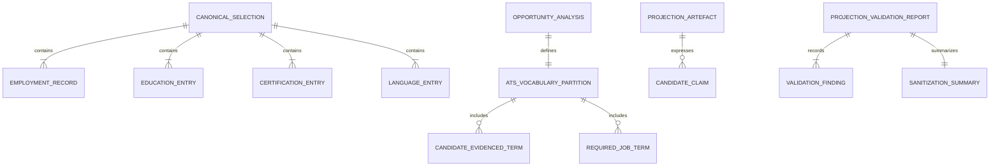

# Data Model: Projection Data Integrity & Provenance Remediation

**Feature**: `006-projection-data-integrity`  
**Date**: 2026-09-24  
**Status**: Completed  

---

## 1. Conceptual Data Entities



---

## 2. Entity Definitions

### 2.1 CanonicalSelection

The frozen factual context loaded into model prompts before projection generation.

- **`selection_metadata`** (Object):
  - `target_slug` (String, required): Slug of the active opportunity.
  - `canonical_source` (String, required): Relative or absolute path to `career-record.yaml`.
  - `frozen_at` (String, required): ISO-8601 timestamp when selection was locked.
- **`employment_records`** (Array of CareerEntry, required):
  - `id` (String): Unique identifier (e.g. `emp-wpp-2025`).
  - `employer` (String): Canonical employer name (immutable).
  - `formal_title` (String): Exact contracted title (immutable).
  - `start_date` (String): Canonical start date (e.g. `Dec 2025`).
  - `end_date` (Optional String): Canonical end date (e.g. `Jul 2026` or `null` for current).
  - `status` (Enum: `current` | `former`): Employment status.
  - `engagement_type` (Enum: `direct_employment` | `consultancy` | `independent_advisory`).
  - `client` (Optional String): Client organization if consultancy.
  - `approved_aliases` (Array of Strings): Permissible presentation variations.
  - `operational_scope` (Array of Strings): Operational responsibilities (cannot be elevated to title).
  - `verified_accomplishments` (Array of Strings): Backed accomplishments.
- **`education`** (Array of EducationEntry, required):
  - `id` (String): e.g. `edu-umc-bsc`.
  - `institution` (String): Canonical institution (e.g. `Universidade de Mogi das Cruzes`).
  - `degree_name` (String): Formal degree title (e.g. `BSc Computer Science`).
  - `degree_level` (String): `BSc` | `MSc` | `PhD` | `Diploma`.
  - `field_of_study` (String): e.g. `Computer Science`.
  - `start_year` (Integer/String): e.g. `1988`.
  - `end_year` (Integer/String): e.g. `1991`.
  - `status` (String): `verified`.
- **`certifications`** (Array of CertificationEntry, required):
  - `id` (String): Unique identifier.
  - `name` (String): Name of certification (e.g. `TOGAF 9 Certified`).
  - `issuing_body` (String): e.g. `The Open Group`.
  - `year` (Optional Integer/String): Year achieved.
  - `status` (String): `verified`.
- **`languages`** (Array of LanguageEntry, required):
  - `language` (String): e.g. `Portuguese`, `English`, `Spanish`.
  - `proficiency` (Enum: `Native / Bilingual` | `Professional Working` | `Elementary` | `Limited Working`).
  - `status` (String): `verified`.

---

### 2.2 EvidencePartitionedVocabulary

ATS vocabulary partition emitted by `opportunity-analyzer` and consumed by `projection-validator`.

- **`target_slug`** (String): Opportunity identifier.
- **`candidate_evidenced_vocabulary`** (Array of Objects):
  - `term` (String): Technology, framework, or skill name.
  - `evidence_source` (Enum: `career_record` | `okf_capability` | `okf_evidence_card`).
  - `evidence_ref` (String): Source identifier (e.g. `career-record.yaml#emp-wpp-2025` or `cap-system-architecture`).
- **`required_job_vocabulary`** (Array of Objects):
  - `term` (String): Platform or capability required by the JD.
  - `status` (String: `unmatched_requirement_gap`).
  - `recommended_framing` (Enum: `explicit_gap` | `transferable_capability` | `adjacent_experience`).

---

### 2.3 ProjectionValidationReport

Machine-readable audit artifact written to `out/<target-slug>/runtime/projection-validation-report.yaml`.

- **`report_metadata`** (Object):
  - `target_slug` (String): Evaluated opportunity slug.
  - `evaluated_at` (String): ISO-8601 evaluation timestamp.
  - `overall_status` (Enum: `PASSED` | `FAILED` | `PASSED_WITH_SANITIZATION`).
  - `validator_version` (String): `1.0.0`.
- **`summary`** (Object):
  - `total_files_audited` (Integer): Count of projection markdown files checked.
  - `total_findings` (Integer): Total discrepancies detected.
  - `sanitized_count` (Integer): Total repairable canonical facts automatically rewritten.
  - `unresolved_defects` (Integer): Total hard integrity failures.
- **`checks`** (Object):
  - `education` (Object: `status`, `findings`).
  - `certifications` (Object: `status`, `findings`).
  - `languages` (Object: `status`, `findings`).
  - `employment_chronology` (Object: `status`, `findings`).
  - `technology_claims` (Object: `status`, `findings`).
  - `cross_opportunity_isolation` (Object: `status`, `findings`).
- **`findings`** (Array of ValidationFinding Objects):
  - `source_file` (String): Relative path of audited markdown file (e.g. `resume-executive.md`).
  - `category` (Enum: `education` | `certification` | `language` | `employment` | `technology` | `isolation`).
  - `severity` (Enum: `FATAL` | `SANITIZED` | `WARNING`).
  - `generated_claim` (String): Verbatim text extracted from projection.
  - `canonical_baseline` (Optional String): Authoritative truth from canonical records.
  - `reason` (String): Human-readable explanation of why the claim is invalid.
  - `action_taken` (Enum: `sanitized_in_place` | `validation_failure_block` | `warning_logged`).

---

## 3. State Transitions & Processing Lifecycle

```text
[Opportunity Spec + Ingested Portfolio]
                   │
                   ▼
  1. Runtime Analysis & Factual Selection
     - Load career-record.yaml
     - Emit canonical-selection.yaml (Complete context: career, edu, certs, langs)
     - Partition ATS vocabulary (candidate_evidenced vs required_job)
                   │
                   ▼
  2. Projection Generation (Isolated Run)
     - Inject 100% of canonical-selection.yaml
     - Consume synthetic fact-free structural templates
     - Render out/<target-slug>/*.md
                   │
                   ▼
  3. Deterministic Validation Pass (scripts/projection_validator.py)
     ├── Scan Education, Certs, Languages, Roles, Tech Claims
     ├── Stage 1: Auto-sanitize repairable facts (dates, titles, degrees)
     │     └── Rewrite out/<target-slug>/*.md in-place
     └── Stage 2: Check for un-sanitizable direct claims (unsupported platforms)
           ├── IF findings contain FATAL:
           │     Set overall_status: FAILED
           │     Exit code 1 (HALT completion)
           └── ELSE IF sanitizations applied:
                 Set overall_status: PASSED_WITH_SANITIZATION
                 Exit code 0 (Allow completion with alerts)
               ELSE:
                 Set overall_status: PASSED
                 Exit code 0
```
